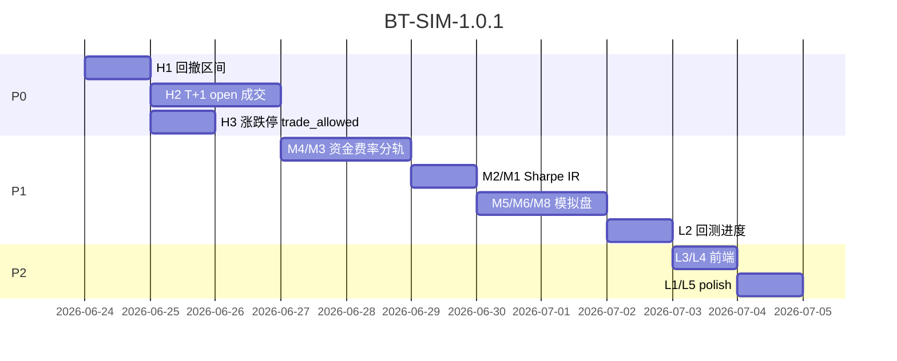

# 回测与模拟交易 — 问题修复与升级方案书

> **版本**：BT-SIM-1.0.2  
> **范围**：`backtest_engine.py` · `trading_rules.py` · `portfolio_svc.py` · 前端 backtest/portfolio  
> **预估工时**：P0 ~3d · P1 ~5d · P2 ~2d  
> **原则**：回测与模拟盘 **共用** `trading_rules` 成交/涨跌停规则；**费率配置分轨**（见 §2.2）

---

## 目录

1. [问题清单与代码核实](#一问题清单与代码核实)
2. [设计原则](#二设计原则)
3. [Phase P0 — 功能错误（~3d）](#phase-p0--功能错误3d)
4. [Phase P1 — 参数与数据（~5d）](#phase-p1--参数与数据5d)
5. [Phase P2 — 体验与扩展（~2d）](#phase-p2--体验与扩展2d)
6. [排期与验收](#六排期与验收)

---

## 一、问题清单与代码核实

### 高优先级（功能错误）

| # | 位置 | 问题 | 核实 |
|---|------|------|------|
| **H1** | `backtest_engine.py:749-759` | 最大回撤起始日：`max_dd_s = dates[0]` 而非 peak 日期 | ✅ **确认 bug** |
| **H2** | `backtest_engine.py:217-222` 等 | 决策与成交均用 **当日 close** | ✅ 未拉取 `open`；T+1 仅限制卖，买仍同 day close |
| **H3** | 涨跌停检查 | buy 路径跳过检查 | ⚠️ **Python 主循环 buy 已有** `trade_allowed`（L324）；需核对 **Rust worker**、`change_pct` 缺失、`apply_limit_rules=False` |

### 中优先级

| # | 位置 | 问题 | 核实 |
|---|------|------|------|
| **M1** | `:803-804` | `drawdowns[-90:]` 截断 | ✅ |
| **M2** | `:747` | Sharpe 假设 rf=0 | ✅ |
| **M3** | `trading_rules.py:13-18` | 费率硬编码 / 回测不可调 | ⚠️ 部分可 env（`AFR_BACKTEST_*`），**API 参数不可调** |
| **M4** | `:210,762,792` | 初始资金 100,000 写死 | ✅ |
| **M5** | `portfolio_svc.py:1082` | 调仓用日历天 ≥7/≥28 | ✅ 未用交易日历 |
| **M6** | `:1256-1257` | `replace_position` 手数估算 | ✅ 高价股可能资金不足 |
| **M7** | `:515-519` | `skip_risk=True` 无审计 | ✅ 仅 v5 sync / 脚本使用 |
| **M8** | `portfolio_analytics.py:88-131` | 已实现 PnL 成本基准未文档化 | ⚠️ journal FIFO 用 **成交价**；持仓 `avg_cost` 用 **含佣金成本价** — 口径不一致 |

### 低优先级

| # | 问题 | 核实 |
|---|------|------|
| **L1** | 月度收益累乘未标准化 | ✅ 可接受，文档化即可 |
| **L2** | 回测无进度 | ✅ → **提升至 P1 末尾** |
| **L3** | Rust 引擎 UI 未开 | ✅ |
| **L4** | 缺 Information Ratio | ✅ |
| **L5** | 持仓缺成本均价 | ⚠️ 前端已有「成本」列；空值为数据问题 |

---

## 二、设计原则

### 2.1 统一成交模型（Execution Model）

```text
信号日 T（close 收盘后生成 rank）
执行日 T+1（open 开盘价 ± 滑点，受涨跌停/停牌约束）
```

- 与 `apply_t1` 语义对齐：**决策滞后一日、成交可成交**
- 回测与 `portfolio_svc.trade()` 共用 `trade_allowed` + `apply_slippage`

**首日边界（非 bug，须文档化）**：

- `di=0` 无 `pending_orders`，当日仅初始化、不产生成交
- 有效回测窗口 = `dates[1:]`（少 1 个调仓执行日）
- 短窗口（如用户选 60 天但策略仅 30 个交易日）会进一步压缩可执行调仓次数 — 在 `_calc_metrics` 注释并返回 `effective_trading_days`

### 2.2 参数外置 — 回测 vs 模拟盘分轨

| 参数 | 回测 | 模拟盘 |
|------|------|--------|
| `initial_cash` | API 可设 | 创建组合时设定 |
| `commission` / `slippage` / `stamp_tax` | **API 可覆盖**（敏感性分析） | **组合级锁定**，创建/编辑组合 settings 时配置；**单笔 trade 不可改** |
| `risk_free_rate` | API / env | 仅 analytics 用，默认 env |
| `exec_mode` | `next_open`（默认）\| `close`（legacy） | 始终按 `resolve_trade_price` 市价规则 |

```python
# 回测请求体
BacktestParams(
    initial_cash: float = 100_000,
    commission_rate: float = BACKTEST_COMMISSION,  # 可覆盖
    stamp_tax_rate: float = STAMP_TAX,
    slippage: float = SLIPPAGE,
    risk_free_rate: float = 0.02,
    exec_mode: "close" | "next_open" = "next_open",
)

# 模拟盘 — portfolios 表 / settings JSON
PortfolioCostSettings(
    commission_rate: float = COMMISSION,  # 创建时写入，trade() 只读
    stamp_tax_rate: float = STAMP_TAX,
)
```

### 2.3 审计与安全

- `skip_risk=True` 必须写 `trade_journal.reason` 或 `risk_audit_log`
- 生产 API 默认 `skip_risk=False`；仅内部 sync 脚本允许

---

## Phase P0 — 功能错误（~3d）

### P0-1 · H1 最大回撤区间修复（~0.25d）

**Bug**（`_calc_metrics`）：

```python
# 现
if dd > max_dd:
    max_dd, max_dd_s, max_dd_e = dd, dates[0], r["date"]

# 改 — 在 if v > peak: 分支同步更新 peak_date
if dd > max_dd:
    max_dd, max_dd_s, max_dd_e = dd, peak_date, r["date"]
```

**风险**：无。仅追踪 `peak_date`，不改净值逻辑。

**验收**：

- [ ] `max_drawdown_period` 起点 = 峰值日
- [ ] 单测 `test_backtest_max_drawdown_period`

---

### P0-2 · H2 成交价格：T+1 开盘价（~1.5d）

#### 前置检查：open 字段完整性

P0-2 开工前先跑：

```sql
SELECT COUNT(*) AS total,
       SUM(CASE WHEN open IS NULL THEN 1 ELSE 0 END) AS null_open
FROM stock_daily_quotes;
```

**当前库核实（2026-05-20）**：`total=110,263`，`null_open=0` — **可开工**。若未来 sync 引入 NULL，fallback 为 close 并写入 `meta.warnings`。

#### 实现要点

1. SQL 拉取增加 `q.open`
2. **信号/执行分离**：

```python
# di=0：无 pending，空跑（初始化 cash/holdings）
# di>=1：先执行昨日 pending_orders @ 当日 open
if di > 0 and pending_orders:
    exec_dt = dt
    exec_prices = {
        c: quotes[c][exec_dt].get("open") or quotes[c][exec_dt]["close"]
        for c in ...
    }
    # 执行 buy/sell
# 当日收盘后：生成 pending_orders → 明日执行
```

3. `_calc_metrics` 内注释：

```python
# T+1 模型：dates[0] 无成交，有效净值序列从 dates[1] 起
# valid_dates = dates[1:]  # 首日仅信号，不计入成交统计
effective_trading_days = max(len(dates) - 1, 1)
```

4. 返回字段增加 `exec_model: "next_open"`、`warmup_days: 1` 避免前端/报告误解
5. `exec_mode=close` 保留 legacy 对比

**验收**：

- [ ] `next_open` 与 `close` 模式 **存在可观察差异**（`|total_return_pct 差| > 0`）— 不绑定方向：跳空低开日 T+1 open 可能低于 signal-day close，next_open 反而更优属正常
- [ ] `effective_trading_days = len(dates) - 1`
- [ ] open 缺失日 fallback + warning

---

### P0-3 · H3 涨跌停检查统一（~1d）

#### change_pct 补算 — 在 `trade_allowed()` 内部

**不在调用方补算**，统一入口：

```python
def trade_allowed(action: str, quote: dict, prev_close: float | None = None) -> bool:
    ...
    chg = quote.get("change_pct")
    if chg is None and prev_close and prev_close > 0:
        close = float(quote.get("close") or 0)
        chg = (close - prev_close) / prev_close * 100
    chg = float(chg or 0)
    ...
```

- 回测引擎在构建 `quote` 时传入 `prev_close`（前一日 close）
- 模拟盘 `resolve_trade_price` 返回的 quote 同样带 `prev_close`
- `change_pct is None` 且无法补算 → **保守拒绝**（`return False`），并 log warning

#### 其余

- 抽取 `_execute_trade(...)` 强制 `trade_allowed`
- Rust worker 对齐；P0 阶段不支持策略可 fallback Python
- 模拟盘 `trade()` 在成交价解析后调用 `trade_allowed`

**验收**：

- [ ] 涨停日无 BUY；跌停日无 SELL
- [ ] `change_pct` 缺失但有 prev_close 时仍能拦截
- [ ] 单测 `test_trade_allowed_infers_change_pct`

---

## Phase P1 — 参数与数据（~5d）

### P1-1 · M4 初始资金参数化（~0.5d）

- `run_backtest(initial_cash=100_000)` 贯穿 cash、年化公式
- 返回 `start_value` = 入参

### P1-2 · M3 费率可配置 — 分轨（~1d）

**回测**：

- `POST /backtest/run` body 增加 `commission` / `slippage` / `stamp_tax`
- `get_cost_params(overrides)` 仅回测路径使用

**模拟盘**：

- `portfolios.settings` 增加 `commission_rate` / `stamp_tax_rate`（创建/编辑组合时写入）
- `trade()` / `split_cost()` 读取组合 settings，**忽略请求体中的费率覆盖**
- 目的：避免用户随意改佣金导致盈亏「看起来很好」但不反映真实账户

### P1-3 · M2 Sharpe + IR（~1d）

**Sharpe**（不依赖 benchmark）：

```python
daily_excess = daily_ret - rf_daily
sharpe = mean(daily_excess) / std(daily_excess) * sqrt(252)
```

- `risk_free_rate` 默认 0.02（env `AFR_RISK_FREE_RATE`）

**Information Ratio**（依赖 benchmark 日净值曲线）：

```python
# active_ret[t] = strategy_daily_ret[t] - benchmark_daily_ret[t]
information_ratio = mean(active_ret) / std(active_ret) * sqrt(252)
```

**Benchmark 来源（实现前已确认）**：

回测结果 **已返回** `benchmark_curve`（`_calc_metrics` → `"benchmark_curve": benchmark_curve or []`）：

| `benchmark_mode` | 曲线来源 | 说明 |
|------------------|----------|------|
| `csi300` / `index_enhance` | `_compute_index_benchmark("sh000300", …)` | 沪深300 买入持有，按日 `{date, value}` |
| `equal`（默认） | `_compute_benchmark_curve(quotes, dates)` | 标的池等权买入持有 |

实现策略：

1. P1-3 **必做 Sharpe**；IR 在 `len(benchmark_curve) >= 2` 且与 `daily_values` 日期对齐时一并计算
2. 曲线缺失或对齐失败（指数 K 线拉取失败等）→ `information_ratio: null`，`meta.warnings` 注明原因；**不阻塞发布**
3. 异步 job 回测（P1-8）完成后 result 内同样含 `benchmark_curve`，IR 计算逻辑与同步路径共用 `_calc_metrics`

> 若未来增加无 benchmark 的极简回测模式，IR 留空即可，无需回退 P2。

### P1-4 · M1 回撤序列完整返回（~0.25d）

- `drawdowns` 全量；前端长图 `slice(-252)`
- 或 `drawdowns_full` + `drawdowns_recent_90`

### P1-5 · M5 调仓交易日历（~1d）

**唯一方案**：用 `stock_daily_quotes` DISTINCT `trade_date` 作为交易日历 — **不引入新依赖**。

```python
def count_trading_days(start: str, end: str) -> int:
    # SELECT COUNT(DISTINCT trade_date) FROM stock_daily_quotes
    # WHERE trade_date > start AND trade_date <= end

# run_scheduled_rebalances
due = count_trading_days(last, today) >= 5   # weekly
due = count_trading_days(last, today) >= 20  # monthly
```

### P1-6 · M6 replace_position 手数（~0.5d）

```python
cash_after_sell = get_portfolio_cash(portfolio_id)
buy_shares = normalize_shares(int(cash_after_sell * 0.98 / est_price / (1 + commission)))
if buy_shares < LOT_SIZE:
    return {"error": "卖出所得不足以买入 1 手", ...}
```

### P1-6b · M8 已实现 PnL 成本核算文档化 + 口径对齐（~0.5d）

**现状（代码核实）**：

| 层级 | 方法 | 成本基准 |
|------|------|----------|
| 持仓 `portfolio_lots` | FIFO 卖出（`_sell_from_lots`，`ORDER BY buy_date`） | `cost_basis_price` = 价 × (1+commission) |
| 持仓展示 `avg_cost` | lots 加权平均 | 含佣金 |
| **已实现 PnL** `portfolio_analytics._journal_stats` | 按 journal FIFO 配对 | **卖出价 − journal 买入成交价**（**不含** commission/tax） |

**问题**：加仓后 journal FIFO 与 lots FIFO 方向一致，但 **PnL 未扣买入佣金、未扣卖出印花税** — 与用户看到的 `avg_cost` 浮盈口径不一致。

**方案**：

1. **文档**：README / 组合页 tooltip 明确「已实现盈亏 = FIFO 配对，卖出净价 − 买入含佣成本」
2. **代码对齐**（推荐 P1-6b 一并做）：

```python
# _journal_stats 卖出侧
sell_net = price * (1 - COMMISSION - STAMP_TAX)  # 每股
buy_basis = cost_basis_price(lot["price"])        # 每股含佣
pnl = take * (sell_net - buy_basis)
```

3. 单测：两次加仓 + 部分卖出，验证 realized_pnl 与 lots 消耗一致

### P1-7 · M7 skip_risk 审计（~0.5d）

- `skip_risk=True` 必填 `reason`
- journal / `risk_audit_log` 前缀 `[SKIP_RISK]`
- 用户 API 拒绝 `skip_risk=True`

### P1-8 · L2 回测进度（~1d）— 从 P2 提前

长回测（3 年+）当前 10–20s，仅显示「运行中…」体验差；后端改动小。

**选定方案：job_id + poll**（优先上线）

- 已有基础设施：`job_queue.enqueue` · `update_job_progress` · `GET /api/system/jobs/{job_id}`（`backend/api/system.py`）
- `POST /backtest/run?async=1` → `{ job_id, poll_url }`；worker 内按日 `update_job_progress(job_id, {"processed_days": di, "total_days": len(dates)})`
- 前端每 **1.5–2s** poll 一次，展示 `processed_days / total_days` progress bar
- 完成后 `job.result` 含完整回测 JSON（含 `benchmark_curve`，供 P1-3 IR）

**Poll vs SSE（实现注意）**：

| | Poll | SSE |
|---|------|-----|
| 上线速度 | ✅ 快，复用现有 job API | 需新 endpoint + 连接管理 |
| SQLite | 10–20s 内 ~10 次只读 SELECT，通常可接受；**避免 poll 与写 job 同一连接争锁** | 服务端推，读竞争更少 |
| 建议 | **P1-8 采用** | 若后续 3 年+ 回测变 60s+ 或并发回测增多，再迁 SSE |

Poll 实现细节：

- job 状态读走 `get_job()`（内存优先，miss 再读 `job_runs` 表）— 短事务、只读
- 进度写入仅在回测 worker 线程，频率 ≤ 每 50 交易日一次（降低写锁）
- 前端 `status === 'done'` 后停止 poll，读 `job.result`

**验收**：

- [ ] 365d 回测可见进度更新
- [ ] 完成后 `job.result` 与同步回测字段一致

---

## Phase P2 — 体验与扩展（~2d）

### P2-1 · L3 Rust 引擎入口（~0.5d）

- 前端 engine 下拉：`python` | `rust（实验）`
- 不可用时 grey out；展示 `engine` + `elapsed_ms`

### P2-2 · L4 Information Ratio 展示（~0.5d）

- P1-3 后端；前端指标卡

### P2-3 · L1 月度收益说明（~0.25d）

- `monthly_method: "compound_daily_in_month"`

### P2-4 · L5 成本列增强（~0.5d）

- 含佣金 tooltip；`pnl_pct` 分列

---

## 六、排期与验收

### 6.1 Gantt



### 6.2 工时

| Phase | 工时 |
|-------|------|
| P0 | ~3d |
| P1 | ~5d（含 P1-8 进度条） |
| P2 | ~2d |
| **合计** | **~10d** |

### 6.3 发布门禁 BT-1.0.1

**P0 必过**

- [ ] H1 max_drawdown_period 正确
- [ ] H2 默认 `next_open`；`warmup_days=1` 文档化
- [ ] H3 `trade_allowed` 内 change_pct 补算

**P1 必过**

- [ ] 回测费率 API 可调；模拟盘费率组合级锁定
- [ ] Sharpe rf + IR
- [ ] 调仓 `count_trading_days` ≥5 / ≥20
- [ ] replace 高价股不误报
- [ ] 已实现 PnL FIFO 口径文档 + 对齐
- [ ] 回测进度 poll

**P2 可选**

- [ ] Rust 入口 / IR 展示 / 成本列 polish

### 6.4 测试

```bash
cd backend
pytest tests/test_backtest_engine.py tests/test_trading_rules.py \
       tests/test_portfolio_svc.py tests/test_portfolio_analytics.py -q
pytest tests/test_backtest_execution.py -q  # 新增
```

---

## 七、立即下一步

1. **P0-1**（0.25d）：修 `max_dd_s` + 单测  
2. **P0-2**（1.5d）：open 已全量 — 直接做 T+1 队列 + `warmup_days`  
3. **P0-3**（1d）：`trade_allowed` 内补算 change_pct  

---

## 附录 A · H3 根因（修订）

Python 主循环 buy 已有 `trade_allowed`。涨停仍买入主要来自：

1. `change_pct` 缺失 → `float(None or 0) == 0` 放行 → **P0-3 在 `trade_allowed` 内补算**  
2. Rust worker 未同步  
3. `apply_limit_rules=False` 测试开关  

---

## 附录 B · 与 SC-BETA / SC-MOM 关系

- 回测默认 `composite` → **composite_v5**（SC-MOM 隔离不变）
- 动量策略回测与 profile 分表分离

---

*文档维护：BT-SIM-1.0.2 · 回测成交模型、费率分轨、FIFO 口径、IR/进度实现注记。*
