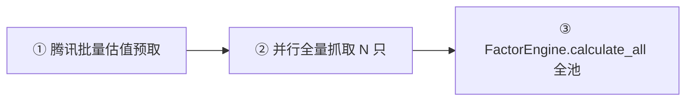
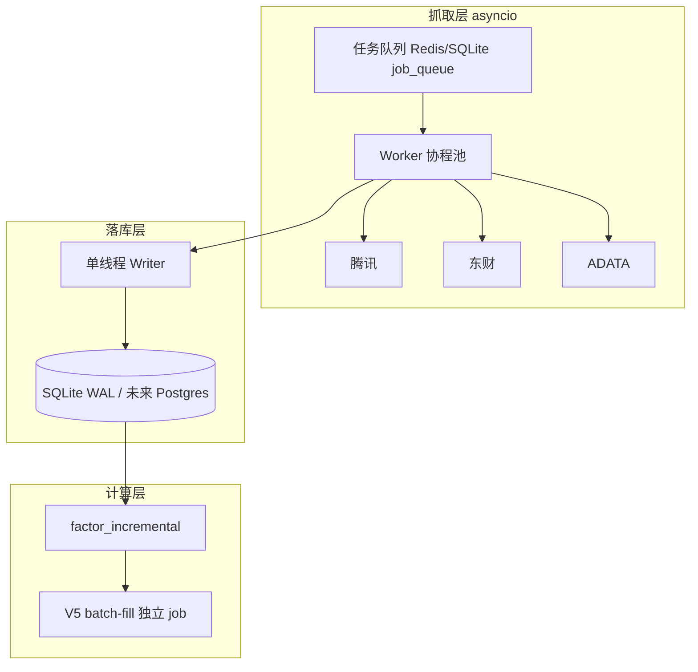

# 批量抓取性能升级方案书

> 版本：v1.1  
> 日期：2026-06-10（落地修订 2026-05-20）  
> 状态：**Phase 0 + 部分 Phase 1/2 已落地**  
> 范围：数据页「批量抓取」`/api/data/fetch-all`、调度器夜间全量、与 `sync-quotes` 增量链路的协同  
> 关联文档：  
> - [ONBOARDING_AND_DATA_SOURCE_PROPOSAL.md](./ONBOARDING_AND_DATA_SOURCE_PROPOSAL.md)（单股 / onboard 快路径）  
> - [BATCH_DIMENSION_SCORE_PROPOSAL.md](./BATCH_DIMENSION_SCORE_PROPOSAL.md)（抓后 V5 batch-fill）  
> - [V2-数据架构升级方案.md](./V2-数据架构升级方案.md)（长期存储演进）

---

## 0. 执行摘要

| 指标 | 现状（99 只，4 并行） | **修正落地目标（v1.1）** | 方案书理想值（v1.0，不保证） |
|------|----------------------|--------------------------|------------------------------|
| 日常 incremental | 15～25 min | **10～15 min** | < 8 min |
| 财报季 / full | 25～40 min | **15～22 min** | < 8 min |
| 因子重复计算 | 2 次/股 | **1 次/批** | 1 次 + 增量因子 |

**核心结论：** 瓶颈是 **I/O 等待 + 单股内串行全量 + SQLite 写锁 + 重复因子**。v1.1 聚焦 **确定能做完** 的最小集，不追求理想化数字。

**已落地（2026-05-20）：** Phase 0 全项；Phase 1 双模式 API、FetchPlanner、行情少拉、令牌桶、熔断、`fetch_step_status`；Phase 2 单股合并 commit + 日志批量写。

**明确暂缓：** 严格财报增量、股内财报表并行、分库、asyncio 全量重写、代理 IP 池、Postgres 迁移。

---

## 1. 现状架构

### 1.1 三条抓取入口（勿混淆）

| 入口 | API / 触发 | 模式 | 并发 |
|------|------------|------|------|
| **批量抓取** | `POST /api/data/fetch-all?mode=incremental\|full` | incremental 默认 / full 深度 | `ThreadPoolExecutor(FETCH_PARALLEL=4)` |
| **单股抓取** | `POST /api/data/fetch/{id}` | 默认 `FINANCE_FAST_PATH=true` | 单任务后台 |
| **行情增量** | `POST /api/market/sync-quotes` | 仅 `_fetch_daily_quotes` + 融资/资金流 | 串行 |
| **调度器** | 每日 18:00 | 全量串行 `finance_fast=False` | 1 路 + sleep 1.5s |

### 1.2 批量抓取三阶段（`backend/api/data.py`）



### 1.3 单股全量流水线（`DataFetcher.fetch_all_for_stock`）

单股内部 **步骤串行**（网络 I/O 为主）：

```
info → quotes(≤2000根) → ex_rights → quote_extras
  → financials(年3表+季3表, sleep 0.5～1s) → indicators
  → valuation → announcements → FactorEngine([单股])
```

并行仅发生在「股与股之间」，单股内形成 **木桶效应**：最慢步骤（财报 6 表）决定该股耗时。

### 1.4 已有基础设施（可复用）

| 能力 | 位置 | 批量抓取是否使用 |
|------|------|------------------|
| WAL + `write_lock` | `database.py` | ✅ 已启用 |
| `finance_fast` 快路径 | `data_fetcher.py` | ❌ 批量强制 full |
| `quote_sync` 增量行情 | `quote_sync.py` | 独立入口 |
| `factor_incremental` | `factor_incremental.py` | ❌ 调度器用，批量未用 |
| `calculate_incremental` | `factor_engine.py` | ❌ |
| 动态轮询超时 | `api.ts` + `data.py` | ✅ 已落地 |
| 腾讯批量 `tencent_quote` | `data.py` 预取 | ✅ |

---

## 2. 瓶颈分析（影响从大到小）

### 2.1 单股内串行全量 I/O（★★★★★）

- 每只股 10+ 次 HTTP，财报步骤间硬编码 `sleep(0.5～1s)`，99 只累计 sleep 仅财报就可达数分钟量级。
- 行情拉 **2000 根**（`DATA_FETCH_DAYS`），对日常更新过度。
- 与「市场行情 sync-quotes（500 根）」策略不一致。

### 2.2 SQLite 写入锁竞争（★★★★☆）

- 4 线程各持连接、多次 `commit`（日志、行情、财报、因子）。
- `write_lock`（RLock）串行化关键写路径，并行度 >6 后 **收益递减甚至负收益**。
- 非 WAL 问题（WAL 已开），而是 **事务粒度过细 + 热点表竞争**。

### 2.3 因子计算重复（★★★★☆）

1. `fetch_all_for_stock` 末尾：`FactorEngine.calculate_all([stock_id])`
2. 批量结束后：`FactorEngine.calculate_all(全池)`
3. 每只 `complete_job` 可能触发 `sync_gaps_after_fetch` + `enqueue_batch_fill`（`AUTO_SCORE_ON_FETCH=true`）

→ CPU + SQLite 写放大，V5 队列可能堆积 99 个 job。

### 2.4 数据源限流与容灾（★★★☆☆）

- 东财 datacenter、腾讯 qt 存在 IP/QPS 限制；akshare fallback 同步阻塞 + `AKSHARE_SLEEP_MS=500`。
- 无统一 **熔断器**：单股某表失败仍走完 6 表 sleep 链。
- 无 **源健康度** 统计，无法动态选路。

### 2.5 缺少抓取层增量语义（★★★☆☆）

- 行情可按 `MAX(trade_date)` 增量（`quote_sync` 已做），但 **批量抓取不走增量**。
- 财报按「全量重拉三表」而非「仅补新报告期」。
- 全量频率过高 → 限流风险 ↑、耗时 ↑。

---

## 3. 升级目标与原则

### 3.1 目标

1. **日常**：批量任务以增量为主，墙钟时间可控（<10 min / 100 只）。
2. **全量**：降为低频（初始化、数据修复、月度校验），可夜间执行。
3. **可观测**：分阶段进度、分步骤耗时、失败可重试粒度到「股×步骤」。
4. **可扩展**：股票池 200～500 只时架构仍成立。

### 3.2 设计原则

| 原则 | 说明 |
|------|------|
| 先减法后加法 | 去掉重复因子、合并 commit，再考虑加线程 |
| 增量优先 | 有本地截止日则跳过网络 |
| 并行边界 | 股级并行 OK；股内步骤可流水线化，慎无限加线程 |
| 评分解耦 | 抓取与 V5 batch-fill 分阶段，批量抓取不逐股排队 |
| 渐进演进 | Phase 0～1 不改存储引擎；Phase 3 再评估 async / 分库 |

---

## 4. 分阶段实施方案

### Phase 0：快速见效（1～2 天，低风险）

**目标：** 不改架构，批量耗时降 30～40%。

| 编号 | 改动 | 文件 | 说明 |
|------|------|------|------|
| P0-1 | 批量关闭逐股因子 | `data_fetcher.py` / `data.py` | 批量模式跳过单股内 `FactorEngine`，仅保留步骤③全池一次 |
| P0-2 | 批量关闭 auto_score | `data.py` → `complete_job(..., auto_score=False)` | 避免 99 次 gap sync + batch-fill 入队 |
| P0-3 | 单股事务合并 | `data_fetcher.py` | 单股抓取结束 `commit` 一次；中间仅 `executemany` |
| P0-4 | 批量行情天数可配 | `config.py` | `AFR_FETCH_ALL_QUOTE_DAYS=500`（全量仍可 2000，日常批量用 500） |
| P0-5 | 调度错峰 | `app.py` scheduler | 批量默认 18:30 后；交易时段禁止 `fetch-all`（可选 API 校验） |

**验收：**

- 99 只批量墙钟 < 20 min（正常网络）
- `data_fetch_log` 无异常暴增；`fetch_jobs` 无 99 个 batch-fill 排队

---

### Phase 1：流程重构（1 周，中风险）

**目标：** 区分「日常增量批量」与「深度全量」，重复 I/O 降 50%。

#### 1.1 双模式 API

```
POST /api/data/fetch-all?mode=incremental   # 默认
POST /api/data/fetch-all?mode=full          # 显式全量
```

| 步骤 | incremental | full |
|------|-------------|------|
| quotes | `last_date+1` → 今，≤120 根 | ≤2000 根 |
| financials | 仅拉新报告期（对比 `MAX(period_end_date)`） | 年+季 6 表 |
| indicators | 仅 `calc_date > last` | 全量 |
| announcements | `limit=10` 增量 | `limit=30` |
| 因子 | `calculate_incremental(ids)` | `calculate_all(ids)` |

实现要点：

- 新增 `FetchPlanner`：读 `stock_daily_quotes` / `financial_reports` / `data_fetch_log` 决定跳过哪些 step。
- 复用 `quote_sync` 的行情增量逻辑，嵌入 `fetch-all` incremental 模式。

#### 1.2 股内步骤并行（受限）

对 **无依赖** 步骤并行（asyncio.gather 或 2 线程子池）：

```
并行组 A: info + valuation(腾讯) + announcements
串行:     quotes → ex_rights → extras
并行组 B: financials 三表（限速 semaphore=2）
串行:     indicators
```

财报表间 sleep 改为 **全局令牌桶**（QPS 限制），而非固定 0.5s。

#### 1.3 熔断与跳过

- 连续 3 次东财失败 → 该股财报步骤标记 `skipped_circuit`，不阻塞池子。
- 记录 `fetch_step_status(stock_id, step, status, at)` 供 UI 展示。

**验收：**

- incremental 模式 99 只 < 8 min
- full 模式功能与现网一致，耗时 ≤ Phase 0 优化后水平

---

### Phase 2：写入与并发优化（2～3 周，中高风险）

**目标：** 并行度可安全提到 6～8，锁等待降 50%。

| 编号 | 方案 | 说明 |
|------|------|------|
| P2-1 | **写入队列单线程** | 抓取线程只产 `WriteOp` 队列，单 writer 线程批量落库（经典 SQLite 并发模式） |
| P2-2 | **连接 per-thread** | 每 worker 独立 `sqlite3.connect` + 仅最终 merge（已部分如此，需统一） |
| P2-3 | **热表拆分** | `data_fetch_log` 异步批量插入（缓冲 50 条或 2s flush） |
| P2-4 | **并行度自适应** | 根据最近 10 股平均耗时 + 错误率动态调 `FETCH_PARALLEL`（4～8） |

#### 分库分表（可选，仅当 N>300 且 P2 不足）

```
afr_quotes.db    — stock_daily_quotes（按 code hash 分 4 文件）
afr_fundamental.db — financial_* 
afr_meta.db      — stocks, fetch_jobs（现有 afr.db）
```

- 查询层通过 `ATTACH` 或 repository 聚合；**仅在 Phase 2 后评估**，避免过早复杂化。

**验收：**

- 8 并行下 incremental 批量 200 只 < 15 min
- `PRAGMA busy_timeout` 触发次数较基线降 50%（需临时指标埋点）

---

### Phase 3：异步架构与工程化（1～2 月，可选）

**目标：** 支撑 500+ 只、可恢复、可水平扩展的抓取流水线。



| 组件 | 技术选型 | 备注 |
|------|----------|------|
| 并发模型 | `asyncio` + `aiohttp` / `httpx` | I/O 密集，开销低于线程 |
| 限流 | 令牌桶 per host | 东财 2 req/s，腾讯 5 req/s 可配 |
| 代理池 | 可选，环境变量注入 | 仅生产大规模启用 |
| 任务持久化 | 扩展 `job_queue` | 抓取 job 可 pause/resume |
| 数据源画像 | `data_source_health` 表 | 记录 p50/p95/错误率，自动排序 |

**与现有 `job_queue` / `factor_incremental` 对齐**，避免重复造轮子。

---

## 5. 抓取模式产品定义（建议）

| 用户操作 | 后端 mode | 说明 |
|----------|-----------|------|
| 数据页「批量抓取」 | `incremental` | 默认；补最近行情 + 新财报 |
| 数据页「深度全量」（新增按钮） | `full` | 低频，需二次确认 |
| 市场行情「全部刷新」 | `quote_sync` | 仅行情，最快 |
| 调度器 18:30 | `incremental` + 周日 `full` | 自动错峰 |
| 新股 onboard | `finance_fast` | 保持现有快路径 |

---

## 6. 配置与环境变量（汇总）

```env
# Phase 0
AFR_FETCH_PARALLEL=4
AFR_FETCH_ALL_AUTO_SCORE=false          # 批量不逐股排队 V5
AFR_FETCH_ALL_SKIP_PER_STOCK_FACTOR=true
AFR_FETCH_ALL_QUOTE_DAYS=500            # 批量行情深度

# Phase 1
AFR_FETCH_DEFAULT_MODE=incremental      # incremental | full
AFR_FINANCE_INCREMENTAL=true
AFR_FETCH_CIRCUIT_BREAKER=3

# Phase 2
AFR_FETCH_WRITER_QUEUE=true
AFR_FETCH_PARALLEL_MAX=8
AFR_FETCH_PARALLEL_MIN=2

# 网络
AFR_HTTP_TIMEOUT=15
AFR_AKSHARE_SLEEP_MS=300                # 降 sleep 需配合熔断
```

---

## 7. 可观测性与验收指标

### 7.1 新增指标（写入 `fetch_batch_runs` 表）

| 字段 | 说明 |
|------|------|
| `run_id` | UUID |
| `mode` | incremental / full |
| `stock_count` | N |
| `parallelism` | 实际并行度 |
| `phase_timings_json` | 预取 / 并行 / 因子 各阶段 ms |
| `per_stock_p50_ms` / `p95_ms` | 单股耗时分布 |
| `error_by_step` | quotes / financials / ... |
| `source_errors` | eastmoney / tencent / akshare 计数 |

### 7.2 KPI

| KPI | 基线 | Phase 1 | Phase 3 |
|-----|------|---------|---------|
| 批量 incremental P95 墙钟 | — | <12 min @100 | <8 min @100 |
| 单股财报步骤失败率 | — | <5% | <2% |
| SQLite busy 等待次数 | — | -50% | -80% |
| 重复因子计算次数 | 2N | N | 0～增量 |

---

## 8. 风险与回退

| 风险 | 缓解 | 回退 |
|------|------|------|
| 增量漏数据 | 每周自动 full 校验 + `MAX(date)` 对账脚本 | 一键 `mode=full` |
| 提高并行触发限流 | 令牌桶 + 自适应降并行 | `FETCH_PARALLEL=4` |
| 写入队列积压 | 监控队列深度，超限降抓取并发 | 关闭 `WRITER_QUEUE` |
| 分库查询复杂 | Phase 3 前不做 | 保持单库 |
| async 改写面大 | 先新模块 `fetch_async/`，旧路径保留 | feature flag |

所有 Phase 0/1 改动 **默认 feature flag 关闭**，灰度开启。

---

## 9. 实施排期（建议）

| 周次 | 交付 | 负责人建议 |
|------|------|------------|
| W1 | Phase 0 全部 + 指标埋点 | 后端 |
| W2 | Phase 1 incremental 模式 + API 参数 | 后端 + 前端（模式选择） |
| W3～W4 | Phase 1 股内并行 + 熔断 + 文档 | 后端 |
| W5～W6 | Phase 2 写入队列 + 自适应并行 | 后端 |
| W7+ | Phase 3 预研（async POC，100 只压测） | 后端 |

---

## 10. Phase 0 立即行动清单（建议本周执行）

- [x] `fetch-all` 调用 `complete_job(..., auto_score=False)`
- [ ] 批量路径 `sync_fetch_one` 增加 `skip_factor=True`，跳过单股因子
- [ ] `AFR_FETCH_ALL_QUOTE_DAYS` 配置项
- [ ] 前端数据页：批量完成后 **单次** 提示「是否运行 V5 重算」（可选按钮，非自动 99 job）
- [ ] README 补充：批量 vs 刷新 vs 全量 三种模式对照表

---

## 11. 附录：耗时估算模型

```
T_batch ≈ T_prefetch
        + (N / P) × T_stock_avg
        + T_factor_pool

T_stock_avg(full) ≈ T_quotes(2000)
                  + T_fin(6 × (RTT + sleep))
                  + T_ind + T_misc

T_stock_avg(incremental) ≈ T_quotes(≤30)
                         + T_fin(0～2 表)
                         + T_ind(增量)
```

其中 `P = FETCH_PARALLEL`，`RTT` 为东财接口往返（典型 0.3～2s）。

**例：99 只，full，P=4，T_stock≈90s**  
→ (99/4)×90 ≈ 2220s ≈ **37 min**（与实测上限一致）

**同条件 incremental，T_stock≈20s**  
→ (99/4)×20 ≈ **8 min**（Phase 1 目标）

---

## 12. 决策待办（评审填写）

| # | 决策项 | 建议 | 确认 |
|---|--------|------|------|
| D1 | 数据页默认改为 incremental | ✅ 是 | **已落地** |
| D2 | Phase 0 立即合并 commit | ✅ 是 | **已落地** |
| D3 | 批量禁用 AUTO_SCORE_ON_FETCH | ✅ 是 | **已落地**（`AFR_FETCH_ALL_AUTO_SCORE=false`） |
| D4 | Phase 2 是否分库 | ⏸ 200 只后再议 | 暂缓 |
| D5 | Phase 3 asyncio 重写 | ⏸ POC 后决 | 暂缓 |

### v1.1 落地文件索引

| 模块 | 路径 |
|------|------|
| 配置 | `backend/config.py`（`AFR_FETCH_*`） |
| 计划器 | `backend/services/fetch_planner.py` |
| 令牌桶 | `backend/services/rate_limiter.py` |
| 熔断 | `backend/services/fetch_circuit.py` |
| 步骤状态 | `backend/services/fetch_step_status.py` + migration 30 |
| 抓取器 | `backend/services/data_fetcher.py` |
| API | `backend/api/data.py` |
| 前端 | `frontend/app/data/page.tsx`（增量 / 深度全量） |

---

*文档维护：v1.1 已同步落地状态；后续仅在大范围行为变更时更新 §1。*
