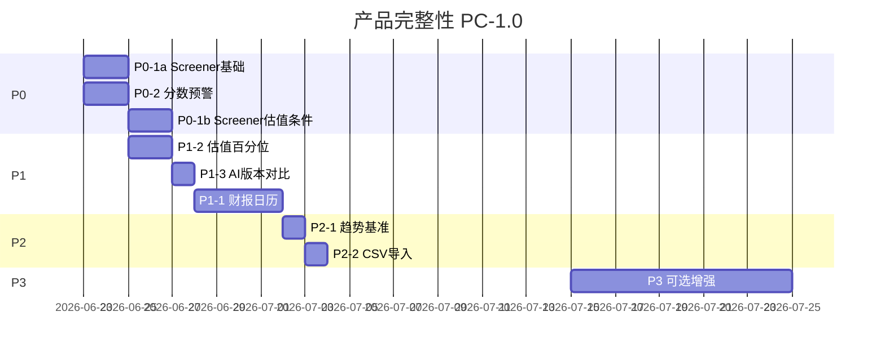

# AI Fundamental Researcher — 产品完整性升级执行方案书

> **版本**：PC-1.0.1  
> **排期起点**：2026-06-21  
> **定位**：在 v3.0（V5 单轨评分）与 UX-1.x（搜索/骨架/sparkline）之上，补齐**研究员高频闭环**  
> **预估工时**：~22 工作日当量（P0 ~8d · P1 ~8d · P2 ~4d · P3 ~10d+ 可选）  
> **配套文档**：`UPGRADE_STRATEGY_v3_V5_ONLY.md` · `UX_UPGRADE_STRATEGY.md`

---

## 目录

1. [现状与缺口](#一现状与缺口)
2. [优先级矩阵](#二优先级矩阵)
3. [目标用户旅程](#三目标用户旅程)
4. [Phase P0 — 核心路径（~8d）](#phase-p0--核心路径8d)
5. [Phase P1 — 体验补全（~8d）](#phase-p1--体验补全8d)
6. [Phase P2 — 增强（~4d）](#phase-p2--增强4d)
7. [Phase P3 — 差异化（~10d+）](#phase-p3--差异化10d)
8. [技术基线与依赖](#八技术基线与依赖)
9. [排期与里程碑](#九排期与里程碑)
10. [验收标准](#十验收标准)
11. [设计确认（PC-1.0.1）](#十一设计确认pc-101)

---

## 一、现状与缺口

### 1.1 已有基础（可复用，勿重复造轮）

| 能力 | 位置 | 产品态 |
|------|------|--------|
| V5 权威分 + 十维 | `v_stock_scores` · `V5ScorePanel` | ✅ 可用 |
| 固定标签筛选 | `stocks/page` `FILTER_PRESETS` | ⚠️ 仅单维 |
| 批量入库 | `POST /stocks/batch-add` + 文本框 | ⚠️ 无 CSV 文件入口 |
| 评分趋势 | `ScoreTrendChart` · `POST /scores/sparkline` | ✅ 无基准线 |
| AI 分析 | `POST /ai/analyze` · `GET /ai/history/{id}` | ⚠️ UI 只展示最新 |
| 估值分位（计算） | `valuation_engine._percentile_low_is_good` | ⚠️ 未上详情主面板 |
| 同业百分位 | `PeerDeepPanel` percentiles | ⚠️ 深页角落，非估值锚点 |
| 财报日历（数据） | `financial_calendar` 表 + rebuild | ❌ 无 UI / 无详情联动 |
| 情绪预警（旧） | `dashboard` alerts 基于 sentiment | ❌ 非 V5 分数变动 |
| 分组对比 | `GroupCompareTable` | ✅ 当前分 N×10 |
| ⌘K 搜索 | `GlobalSearch` code+name | ⚠️ 未扩展语义 |
| 沪深300 行情 | `market_index` sh000300 | ✅ 可叠加趋势 |

### 1.2 缺口 → 用户痛点

```text
找票：只能点预设标签，无法「消费 + 分>60 + 估值低于中位」组合 screener
知变：分数单日跳 10 分 / 一票否决 → 用户不知道
解释：分数变了不知道是否因财报披露 — 缺催化剂时间轴
读懂：估值 40 分不知 PE 在历史高位还是低位
判断：分数涨但跑输沪深300 — 趋势图缺基准
追溯：AI 三周前「推荐」→ 今「谨慎」 — 历史在库中不可见
入库：Excel 观察列表需手贴代码 — CSV 体验未产品化
```

---

## 二、优先级矩阵

| # | 功能 | 优先级 | 工程量 | 价值 | Phase |
|---|------|--------|--------|------|-------|
| 1 | **多维筛选器 Screener** | P0 | 中（3–4d） | 极高 | P0 |
| 2 | **分数变动预警** | P0 | 小（1–2d） | 高 | P0 |
| 3 | **财报日历** | P1 | 大（3–4d） | 高 | P1 |
| 4 | **估值历史百分位** | P1 | 中（2–3d） | 高 | P1 |
| 5 | **趋势图基准叠加** | P2 | 小（1d） | 中 | P2 |
| 6 | **AI 分析版本对比** | P1 | 小（1d） | 中高 | P1 |
| 7 | **批量 CSV 导入** | P2 | 小（1d） | 中 | P2 |
| 8 | **分组组合表现** | P3 | 大（5d+） | 中高 | P3 |
| 9 | **⌘K 扩展搜索** | P3 | 中（2d） | 中 | P3 |
| 10 | **移动端图表手势** | P3 | 中（2d） | 低 | P3 |

---

## 三、目标用户旅程

升级后研究员典型路径：


**North Star**：从「看分」到「筛票 → 监控 → 解释变化 → 决策」闭环。

---

## Phase P0 — 核心路径（~8d）

### P0-1 · 多维筛选器 Screener（#1，~4d）

**目标**：`分数 > 60 AND 行业 = 消费 AND 估值 < 历史中位` 类组合。

#### 后端（~1.5d）

```text
GET /api/screener/query
  ?score_min=60&score_max=100
  &industry=消费
  &val_pct_max=50          # PE 历史百分位上限（见 P1-4 数据源）
  &veto=ok|exclude|discount
  &dim_fundamental_tier_min=1
  &sort=score&limit=100
```

- 主表：`v_stock_scores` + 可选 JOIN `valuation_snapshots` / 百分位缓存表  
- 行业：`industry_sw` / `industry` 模糊或枚举  
- 保存筛选：`POST /api/screener/presets` → `screener_presets` 表（user 级，单机可先 localStorage）

#### 前端（~2d）

- 新页 `/screener` 或 `stocks` 页「高级筛选」Drawer  
- 条件行：字段 + 运算符 + 值（AND 组合）  
- 结果表复用 `StockTable` + sparkline  
- 预设：「高分消费低估值」「需回避剔除」

#### 与现有 FILTER_PRESETS 关系

- 预设标签保留为**快捷入口**；高级筛选为超集  
- URL 持久化：`/screener?score_min=60&industry=消费`（复用 UX-10 模式）

**验收**：

- [ ] 三条件 AND 返回正确子集  
- [ ] 结果可「加入分组」  
- [ ] 100 只池 < 500ms（索引 + v_stock_scores）

---

### P0-2 · 分数变动监控 / 预警（#2，~2d）

**目标**：单日 |Δscore|>10 或 `veto_status` 变化 → 用户可见。

#### 最小实现（MVP）

| 层 | 实现 |
|----|------|
| 存储 | `score_change_log` 表（见 §11.1 字段与唯一键） |
| 检测 | **每次 V5 落库后**调用 `record_score_change_if_any()`（Path A 单股 + Path B batch 统一入口） |
| 推送 | **仅** `trigger_source=nightly_cron\|batch_job` 且 `notify=1` 的记录 → Dashboard Toast + Card |
| API | `GET /api/alerts/score-changes?since=&limit=20&notify_only=1` |

```python
# reason_code 枚举
SCORE_JUMP = "delta_gt_10"
VETO_TRIGGERED = "veto_exclude"
VETO_LIFTED = "veto_cleared"
```

#### 触发时机（已确认，见 §11.1）

- **检测**：每次 `persist_v5_score` 后必跑 diff（含手动刷新单股 Path A）  
- **用户预警**：仅 nightly cron / 全池 batch job 写入 `notify=1`；单股 inline 只记审计 log，不弹 Toast  
- **幂等**：`UNIQUE(stock_id, calc_date)`，同日重复重算 UPSERT 分数、不重复计数预警

#### 调度

- nightly：cron → `compute_all_v5_scores()` → batch 末尾 `flush_score_change_alerts(trigger='nightly_cron')`  
- job_queue Path B：batch 结束同样 flush，`trigger='batch_job'`  
- 与旧 `dashboard/alerts`（情绪）**并存**，新 Card 标「V5 分数变动」

#### 前端（~0.5d）

- `page.tsx` Dashboard：顶部可折叠 Alert 列表（默认 `notify_only=1`）  
- 点击跳转 `/stocks/{code}`  
- `useToast` 登录后首次加载：仅展示未读 `notify=1` 条目

**验收**：

- [ ] 模拟单股 delta=12 + nightly 触发 → Dashboard 可见  
- [ ] 同日单股手动重算两次 → log 仅 1 行、Toast 不重复  
- [ ] 单股 inline 重算 → log 有记录、Dashboard 无 Toast  
- [ ] veto exclude 触发独立 badge  
- [ ] 无变动时不弹 Toast

---

## Phase P1 — 体验补全（~8d）

### P1-1 · 财报日历（#3，~4d）

**现状**：`financial_calendar.py` + `financial_reports` rebuild 已有，**零 UI**。

#### 后端（~1d）

- `GET /api/stocks/{id}/calendar?ahead=90` — 未来披露 + 历史节点  
- `GET /api/calendar/upcoming?days=14` — 全池即将披露  
- 调度：weekly rebuild + 可选 akshare 真实披露日（Phase 1.5）

#### 前端（~2d）

- 详情页「概览」：**催化剂时间轴**（竖线 Timeline）  
- Dashboard 小卡：「7 日内财报 N 只」  
- 分数变动 log 联动：见 §11.2（精确披露日 vs 季度窗口，**不用** blanket ±3 天）

#### 数据策略

| 阶段 | 来源 | `source` 字段 |
|------|------|---------------|
| MVP | `financial_reports.report_date` | `report_date`（精确） |
| MVP | 无 report_date 时 period_end+45 | `conservative+45`（仅季度窗口） |
| 1.5 | 东财 / 巨潮披露日 API | `exchange`（精确） |

**验收**：

- [ ] 600519 详情见至少 1 个历史财报节点  
- [ ] 全池 upcoming 列表可点击进详情  
- [ ] `report_date` 源：变动日=披露日才标 `near_earnings=exact`  
- [ ] `conservative+45` 源：仅标 `near_earnings=quarter_window`，不与 ±3 天混用

---

### P1-2 · 估值历史百分位（#4，~2.5d）

**现状**：`valuation_engine` 有分位算法；`PeerDeepPanel` 有同业百分位，**V5 估值维缺锚点**。

#### 后端（~1d）

```text
GET /api/stocks/{id}/valuation/percentile
→ { pe, pb, pe_pct_5y, pb_pct_5y, industry_pe_pct, as_of_date }
```

- 从 `valuation_history` / 日线估值快照算 5 年百分位  
- 复用 `_percentile_low_is_good` 逆向展示：「当前 PE 处于历史 23% 分位（偏低）」

#### 前端（~1.5d）

- `V5ScorePanel` 估值维下方：**百分位条**（0–100，标记当前点）  
- 文案：`PE 18.2 · 历史 23% 分位 · 行业中位 45%`

**验收**：

- [ ] 百分位与 PeerDeep 同业数据不矛盾  
- [ ] 缺历史时显示「数据不足」

---

### P1-3 · AI 分析版本对比（#6，~1d）

**现状**：`GET /api/ai/history/{stock_id}` 已有；`StockAiCommentarySection` 只渲染 `[0]`。

#### 实现（~1d）

- `AiAnalysisCompare.tsx`：下拉选「当前 vs 上一版 / 3 周前」  
- Diff 摘要：结论关键词变化（推荐→谨慎）、亮点/风险条数变化  
- 结构化 v2 分析用 `detectAnalysisFormat`（见 UX U3-5）  
- Legacy 纯文本：左右并排或折叠对比

**验收**：

- [ ] ≥2 条 history 时可选对比  
- [ ] 显示 `generated_at` 时间差

---

## Phase P2 — 增强（~4d）

### P2-1 · 趋势图基准叠加（#5，~1d）

**现状**：`ScoreTrendChart` 仅绝对分；`market_index` 有沪深300。

- API：`GET /scores/trend/{id}?benchmark=sh000300` 返回 `{ stock_trend, benchmark_rebased }`  
- 基准线：同期指数涨跌幅 **rebasing 到 100** 与 score 双 Y 轴或归一化  
- 可选：行业平均分（`v_stock_scores` 按 industry AVG score）

**验收**：

- [ ] 30 天图可切换「叠加沪深300」  
- [ ] 图例清晰

---

### P2-2 · 批量 CSV 导入（#7，~1d，含去重预览）

**现状**：`batch-add` API + 文本框粘贴**已实现**；后端 `register_stocks(..., skip_existing=True)` 已跳过重复，但**前端无预览去重**，重复导入体验差。

**1d 工时构成**（已确认纳入）：

| 子项 | 工时 |
|------|------|
| CSV 文件解析 + 模板下载 | ~0.25d |
| **预览去重**（对比现有持仓/全池 active） | ~0.25d |
| 预览 UI（新增 / 已存在 / 无效 三态）+ 确认入库 | ~0.35d |
| README 一节 | ~0.15d |

- 前端：`<input type="file" accept=".csv,.txt">` 解析 code 列（首列或 header `code`）  
- 预览：`POST /api/stocks/batch-add/preview`（或 `GET /stocks/codes` 客户端比对）  
  - 返回 `{ new: [], existing: [], invalid: [] }`  
  - UI 默认勾选「仅导入新增」；已存在行灰色展示、可取消勾选  
- 确认 → 调现有 `batch-add`（仅 `new` 列表）+ onboard 流  
- 模板下载：`watchlist_template.csv`

**验收**：

- [ ] 上传 50 行 CSV 成功入库  
- [ ] 错误行单独列出  
- [ ] 20 行中 5 行已存在 → 预览标灰、默认不重复提交  
- [ ] 用户可显式勾选「仍尝试导入已存在项」（后端仍 skip，提示已跳过）

---

## Phase P3 — 差异化（~10d+，可选）

### P3-1 · 分组模拟组合表现（#8，~5d+）

- 输入：分组 ID + 等权  
- 用 `stock_daily_quotes` 算组合 NAV vs 沪深300  
- UI：在 `GroupCompareTable` 增「表现」Tab  
- 依赖：价格完整性（DataHealth 联动）

### P3-2 · ⌘K 搜索扩展（#9，~2d）

- 索引扩展：`industry_sw`、风险 flag 关键词、`v5_breakdown_json` 摘要  
- 服务端：`GET /api/search?q=` FTS 或 内存索引 rebuild nightly  
- 结果分组：股票 / 行业 / 主题

### P3-3 · 移动端图表手势（#10，~2d）

- 方案 A：`recharts` + `Brush` 组件（低成本）  
- 方案 B：详情趋势切 `ECharts`（touch zoom）  
- 仅 `ScoreTrendChart` + K 线详情 Tab

---

## 八、技术基线与依赖

### 8.1 新表 / API 汇总

| 对象 | Phase | 说明 |
|------|-------|------|
| `screener_presets` | P0 | 可选；可先 localStorage |
| `score_change_log` | P0 | 变动审计 + 预警源；`UNIQUE(stock_id,calc_date)`；字段含 `trigger_source`, `notify`, `near_earnings` |
| `GET /api/screener/query` | P0 | 核心 |
| `GET /api/alerts/score-changes` | P0 | 预警；默认 `notify_only=1` |
| `POST /api/stocks/batch-add/preview` | P2 | CSV 去重预览 |
| `GET /api/stocks/{id}/calendar` | P1 | 财报 |
| `GET /api/stocks/{id}/valuation/percentile` | P1 | 估值锚点 |
| trend + benchmark | P2 | 扩展已有 trend |

### 8.2 前置依赖

| 功能 | 依赖 |
|------|------|
| Screener 估值条件 | P1-2 百分位 API 或同步先做简化版（仅 score/industry/veto） |
| 预警 | v3 V5 batch 稳定、`composite_v5` 日更 |
| 基准叠加 | `market_index` 日 K 缓存 |
| 组合表现 | 行情覆盖率 >95%（DataHealthCard） |

**建议 P0-1 分两期**：  
- **P0-1a**（2d）：score + industry + veto + 十维 tier  
- **P0-1b**（2d）：估值百分位条件（P1-2 完成后接入）

### 8.3 与现有路线图关系

```text
v3.0 V5 单轨          ──► Screener / 预警 的数据源
UX-1.x（搜索/sparkline）──► Screener 结果表 UI 复用
本产品完整性 PC-1.x    ──► 研究员闭环（独立里程碑 PC-1.0）
```

---

## 九、排期与里程碑

### 9.1 Gantt（2026-06-21 起）



> P0-1 与 P0-2 **可并行**（不同 owner / 不同文件）。

### 9.2 里程碑

| 版本 | 交付 | 目标日 |
|------|------|--------|
| **PC-0.9** | Screener 基础 + 分数预警 | 06-27 |
| **PC-1.0** | + 估值百分位 + AI 对比 + 财报日历 + P2 | 07-08 |
| **PC-1.1** | P3 可选（组合表现 / 搜索 / 移动端） | 按需 |

### 9.3 工时汇总

| Phase | 工时 |
|-------|------|
| P0 | ~8d |
| P1 | ~8d |
| P2 | ~2d |
| P3 | ~10d+（可选） |
| **PC-1.0 核心** | **~18d** |

---

## 十、验收标准

### 10.1 核心闭环（PC-1.0 门禁）

- [ ] Screener：3 条件 AND 可用，结果可导出/加组  
- [ ] 预警：|Δscore|>10 或 veto 变化 → Dashboard + log  
- [ ] 财报：详情 Timeline ≥1 节点；7 日 upcoming 可见  
- [ ] 估值：V5 面板显示 PE/PB 历史百分位  
- [ ] AI：≥2 条 history 可对比  
- [ ] 趋势：可选叠加沪深300  
- [ ] CSV：文件导入复用 batch-add 成功

### 10.2 量化指标

| 指标 | 目标 |
|------|------|
| Screener P95 延迟 | <500ms（100 只池） |
| 预警延迟 | V5 batch 完成后 5 分钟内可见 |
| 财报节点覆盖率 | 有财报数据的股票 ≥80% 有 calendar 行 |
| CSV 导入 | 100 行 <30s 完成入库 |

### 10.3 Closure Checklist

- [ ] P0-1 Screener  
- [ ] P0-2 score_change_log + 预警 UI  
- [ ] P1-1 财报日历 UI  
- [ ] P1-2 估值百分位  
- [ ] P1-3 AI 版本对比  
- [ ] P2-1 趋势基准  
- [ ] P2-2 CSV 导入产品化  
- [ ] P3（可选）组合表现 / ⌘K 扩展 / 移动手势  

---

## 十一、立即下一步

1. **P0-2**（~2d）：`score_change_log` + Dashboard 预警 Card — 工程量小、感知强  
2. **P0-1a**（~2d）：Screener API + 页（score/industry/veto）— 与 P0-2 并行  
3. **P1-2**（~2d）：估值百分位 — 解锁 Screener 估值条件与 V5 面板锚点  

---

## 十一、设计确认（PC-1.0.1）

### 11.1 score_change_log：触发时机与幂等

**结论**：检测与推送**分离**——检测每次 V5 落库必跑；用户可见预警仅 cron/batch。

#### V5 落库路径（现状）

| 路径 | 入口 | 典型场景 |
|------|------|----------|
| Path A | `get_stock_v5_score` ← `fetch_job` / 手动刷新 | 单股 |
| Path B | `compute_all_v5_scores` ← `job_queue` / `v5_data_sync` / cron | 批量 /  nightly |

#### 统一钩子

在 `persist_v5_score`（或等价写库函数）末尾：

```python
def record_score_change_if_any(
    stock_id, calc_date, score_before, score_after,
    veto_before, veto_after, *, trigger_source: str,
) -> None:
    """写入 score_change_log；幂等键 (stock_id, calc_date)。"""
```

| 字段 | 说明 |
|------|------|
| `trigger_source` | `inline` \| `batch_job` \| `nightly_cron` |
| `notify` | 0/1；仅 `batch_job` / `nightly_cron` 且触发阈值时为 1 |
| `near_earnings` | NULL \| `exact` \| `quarter_window`（见 §11.2） |

#### 幂等规则

```sql
UNIQUE(stock_id, calc_date)
-- 同日重复重算：UPSERT score_after/delta/reason_code，不 INSERT 新行
-- notify：若已有 notify=1 且用户已读，不重复弹 Toast（可选 read_at 字段）
```

#### 对比基准

- **非**「昨日 vs 今日全表 diff」——改为**单股写库时**读该 `(stock_id, calc_date)` 旧值 vs 新值  
- 避免 batch 与 inline 双跑产生重复；cron 全池跑完等价于逐股 UPSERT

#### 用户可见策略

| trigger_source | 写 log | Dashboard / Toast |
|----------------|--------|-------------------|
| `nightly_cron` | ✅ | ✅（超阈值） |
| `batch_job` | ✅ | ✅（超阈值） |
| `inline` | ✅ | ❌（详情页「分数变动历史」可查） |

---

### 11.2 near_earnings：精确披露日 vs 季度窗口

**结论**：取消 blanket「变动日 ±3 天 = near_earnings」；按 `financial_calendar.source` 分级。

| calendar.source | 标记逻辑 | UI 文案 |
|-----------------|----------|---------|
| `report_date` / `exchange` | `calc_date == disclosure_date` → `near_earnings=exact` | 「财报披露日」 |
| `conservative+45` | 变动日落在该报告期**法定披露窗口**内 → `quarter_window` | 「Q1 披露季（估算）」 |

#### A 股法定披露窗口（MVP 硬编码）

| report_type | 窗口（含首尾） |
|-------------|----------------|
| Q1 | 4-01 ~ 4-30 |
| 半年报 | 7-01 ~ 8-31 |
| Q3 | 10-01 ~ 10-31 |
| 年报 | 1-01 ~ 4-30（次年） |

- 窗口判断用 `period_end_date` 推导季度，**不用** disclosure_date ±3  
- 精确源：仅 `calc_date == disclosure_date` 才标 exact（允许 0 天，不做 ±3 扩展）  
- Phase 1.5 接入交易所真实披露日后，exact 比例上升，quarter_window 降级为兜底

#### score_change_log 联动

```python
near_earnings = classify_near_earnings(
    stock_id, calc_date, calendar_rows
)
# → None | "exact" | "quarter_window"
```

---

### 11.3 P2-2 CSV 去重预览

**结论**：原 1d 估算**未显式列出**去重；PC-1.0.1 已**纳入**（见 P2-2 工时表，~0.25d 预览 API + ~0.35d 三态 UI）。

后端可选轻量接口：

```text
POST /api/stocks/batch-add/preview
Body: { "codes": ["600519", ...] }
→ { "new": [...], "existing": [...], "invalid": [...] }
```

不写入库；与 `register_stocks(skip_existing=True)` 语义一致，仅提前暴露给 UI。

---

*文档维护：PC-1.0.1 · 与 v3 / UX 路线图并列；发布 PC-1.0 后更新 README 产品能力矩阵。*
