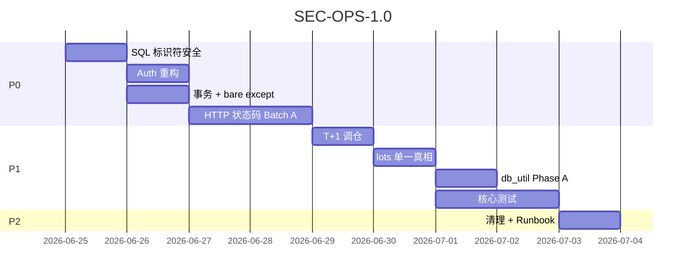

# 项目成熟度与安全加固 — 改进方案书

> **版本**：SEC-OPS-1.0.2  
> **范围**：API 安全 · 数据库事务 · 错误契约 · 测试 · 模拟盘一致性 · 运维  
> **预估工时**：P0 ~4.5d · P1 ~5d · P2 ~2d  
> **与 BT-SIM 关系**：本方案优先于 BT-SIM P1 进度条等体验项；BT-SIM P0 可并行

---

## 目录

1. [审计核实摘要](#一审计核实摘要)
2. [设计原则](#二设计原则)
3. [Phase P0 — Critical + High（~4d）](#phase-p0--critical--high4d)
4. [Phase P1 — Medium（~5d）](#phase-p1--medium5d)
5. [Phase P2 — Low（~2d）](#phase-p2--low2d)
6. [测试补强计划](#六测试补强计划)
7. [部署门禁与排期](#七部署门禁与排期)

---

## 一、审计核实摘要

| # | 级别 | 审计结论 | 代码核实 |
|---|------|----------|----------|
| 1 | 🔴 | `dashboard.py` SQL 注入 | ⚠️ **table/col 来自 L154–163 硬编码元组**；`/health` **无 Query 参数**传入标识符 — **当前不可利用**（见 §P0-1 核实）；f-string 仍为模式债 |
| 2 | 🟠 | Auth 旁路 | ✅ `API_KEY_REQUIRED=false` 或 `API_KEY` 空 → **全 bypass**；开启后 **GET 仍免鉴权** |
| 3 | 🟠 | 多步 DELETE 无事务 | ✅ `delete_portfolio` 5 条 DELETE 无 `with conn:` |
| 4 | 🟠 | bare `except` | ✅ `dashboard.py:172,256` · `advanced.py:144` · `system.py:28` 等 |
| 5 | 🟠 | 200 返回 error | ✅ `technical.py` · `market.py` · `realtime.py` 等大量 `return {"error":...}` |
| 6 | 🟠 | 测试覆盖低 | ⚠️ `test_v5_scorer.py` 存在（~160 行）；**portfolio_svc / portfolio_analytics / factor_engine 无专项测试** |
| 7 | 🟡 | screener sort_col f-string | ✅ 已有 `ALLOWED_SORT` 白名单，风险低 |
| 8 | 🟡 | profile 无 UNIQUE | ❌ **已有** `PRIMARY KEY (stock_id, calc_date, profile)` + `INSERT OR REPLACE` — **降级为文档/迁移一致性检查** |
| 9 | 🟡 | CORS `*` | ✅ `config.CORS_ORIGINS` 默认 `"*"` |
| 10 | 🟡 | 模拟盘无 T+1 | ⚠️ **`trade(apply_t1=True)` 默认有门控**；`build_from_top_n` L671 **`apply_t1=False` 绕过卖出约束** — 见 P1-1 精确改法（非全局改买入 T+1） |
| 11 | 🟡 | lots/positions 双写漂移 | ⚠️ positions 写入经 `_sync_positions_from_lots`；仅 `turtle_stop_price` 直写 positions — 风险中等 |
| 12 | 🔵 | debate 前端残留 | ✅ `api.ts` 已 stub reject；**app 路由无 debate 引用** — 清理 dead code 即可 |
| 13 | 🔵 | SQLite 无 WAL | ⚠️ **`database.init()` 已 WAL**；`portfolio_svc` 等 **直连 `sqlite3.connect` 未统一 PRAGMA** |
| 14 | 🔵 | dead import slippage | ✅ `backtest_engine` import `apply_slippage` 但主循环用局部 `_slippage` 乘算 |

---

## 二、设计原则

### 2.1 安全默认（Secure by Default）

- 生产环境 **必须** `AFR_API_KEY_REQUIRED=true` 且 `AFR_API_KEY` 非空
- 写操作（POST/PUT/PATCH/DELETE）**永远**校验 Key，不依赖「全局开关关了就全放行」
- CORS 生产白名单；开发可用 `*`

### 2.2 错误契约（HTTP Semantics）

```python
# 统一 helper（新建 backend/api/errors.py）
def api_error(status: int, code: str, message: str, **extra):
    raise HTTPException(status_code=status, detail={"error": code, "message": message, **extra})
```

- 4xx/5xx 用真实 HTTP 状态码；body 保留 `error` 字段供前端解析
- 降级场景（缓存 miss、第三方超时）可 200 + `degraded: true`，与 **硬错误** 区分

### 2.3 数据库访问规范

- 多语句变更：**单连接 + 显式事务**（`with conn:` 或 `BEGIN IMMEDIATE`）
- 新连接工厂：`db_connect()` 统一 `PRAGMA journal_mode=WAL` · `busy_timeout=5000` · `foreign_keys=ON`
- 禁止在新代码中用 f-string 拼 **列名/表名**（即使来源内部）

### 2.4 可观测性

- 禁止 bare `except:`；捕获 `Exception` + `logger.exception`
- 区分：`NoDataError`（info）vs `UnexpectedError`（error + Sentry 可选）

---

## Phase P0 — Critical + High（~4d）

### P0-1 · #1 SQL 标识符安全（~0.5d）

**实现前核实（2026-05-20 已跑）**：

- 端点：`GET /api/dashboard/health`（`data_health()`）
- `table` / `col` **仅**来自函数内 `checks = [...]` 硬编码元组（L154–163）
- 路由 **无** `Query` / path 参数传入标识符；循环变量 `sid` 来自 DB `stocks` 表
- **结论**：当前 **非 Critical 可利用**；P0-1 目标为消除模式债，防止未来 refactor 引入外部输入

**文件**：`backend/api/dashboard.py`

**改法**：静态查询表，不用 f-string 拼标识符：

```python
FRESHNESS_QUERIES: dict[str, tuple[str, str, bool]] = {
    "quote": ("SELECT trade_date FROM stock_daily_quotes WHERE stock_id=? ORDER BY trade_date DESC LIMIT 1", "trade_date", False),
    "fundamental": ("SELECT calc_date FROM factor_scores WHERE stock_id=? ORDER BY calc_date DESC LIMIT 1", "calc_date", False),
    # ...
}
for label, (sql, col, use_datetime) in FRESHNESS_QUERIES.items():
    row = conn.execute(sql, (sid,)).fetchone()
```

**验收**：

- [ ] `dashboard.py` 无 f-string SQL 标识符
- [ ] 实现前/后各跑：`rg 'f"SELECT.*\{' backend/api/dashboard.py` 零命中
- [ ] 确认 `/health` 路由签名无 `col`/`table` 入参（代码 review checklist）

---

### P0-2 · #2 API 鉴权重构（~1d）

**文件**：`backend/middleware.py` · `backend/config.py` · `README.md` / `launch.sh`

**逻辑**：

```python
def _requires_auth(request: Request) -> bool:
    if request.method in ("POST", "PUT", "PATCH", "DELETE"):
        return True
    # 敏感 GET（可选 Phase 2）：导出、批量下载
    return False

async def dispatch(...):
    if _requires_auth(request):
        if not API_KEY or key != API_KEY:
            return JSONResponse(401, ...)
    elif API_KEY_REQUIRED and path not in PUBLIC_PATHS:
        # 生产：即使 GET 也要求 Key（可配置 AFR_AUTH_ALL=true）
        ...
    return await call_next(request)
```

**部署**：

- `launch.sh daemon` 生产 profile 检测：无 Key 时 **warn + 拒绝启动**（或 `--insecure` 显式跳过）
- 文档：`AFR_API_KEY` · `AFR_API_KEY_REQUIRED` · `AFR_AUTH_ALL`

**验收**：

- [ ] `API_KEY_REQUIRED=false` 时 POST `/api/scores/recalculate` 仍 401（Key 逻辑独立于开关）
- [ ] 有 Key 时 POST 正常
- [ ] 单测 `test_auth_middleware.py`

---

### P0-3 · #3 事务包装（~1d）

**范围**（多步写、无 `with conn:`）：

| 函数 | 文件 | 风险 |
|------|------|------|
| `delete_portfolio` | `portfolio_svc.py` | 5 条 DELETE 中途失败 → 孤儿 lots/journal |
| `_sync_positions_from_lots` | `portfolio_svc.py` | DELETE positions + 多条 INSERT；被 `trade` / 调仓多处调用 |
| `build_from_top_n` | `portfolio_svc.py` | 逐股 `trade()` + 中间 `commit` → **部分调仓**（卖了 A 未买 B） |
| `replace_position` | `portfolio_svc.py` | 卖 + 买两步 |

#### 3a · 单连接 + 显式事务

```python
def delete_portfolio(portfolio_id: int) -> dict:
    conn = sqlite3.connect(DB_PATH)
    try:
        with conn:
            for sql, args in deletes:
                conn.execute(sql, args)
    finally:
        conn.close()
```

- `_sync_positions_from_lots`：**不单独开连接**；调用方传入同一 `conn`，在父级 `with conn:` 内执行
- `trade(..., _conn=conn)` 已有外部连接模式 — 调仓循环复用 **同一 conn + 单次 commit**

#### 3b · `build_from_top_n` 一致性策略（二选一，实现时定稿）

| 模式 | 行为 | 适用 |
|------|------|------|
| **A. all-or-nothing**（推荐默认） | 整段卖+买在同一 `with conn:`；任一步失败 → ROLLBACK | 定时调仓、一键建仓 |
| **B. 允许部分成功** | 逐股提交但返回 `partial_rebalance: true` + `sold[]` / `skipped_sell[]` / `bought[]` | 手动调仓、需可见进度 |

**方案默认 A**；若选 B，必须在 API 响应与 `trade_journal.reason` 中记录，前端展示「部分调仓」。

```python
# all-or-nothing 骨架
conn = sqlite3.connect(DB_PATH)
try:
    with conn:
        for code in to_sell:
            trade(..., _conn=conn)  # 内部不 commit
        for code in to_buy:
            trade(..., _conn=conn)
except Exception:
    raise  # 自动 ROLLBACK
finally:
    conn.close()
```

**验收**：

- [ ] `_sync_positions_from_lots` 无独立 `commit`（仅父事务提交）
- [ ] 模拟 mid-rebalance 失败（monkeypatch 第 N 笔 buy）→ lots/cash/positions 与调仓前一致（模式 A）
- [ ] 或模式 B：`partial_rebalance=true` 且清单完整
- [ ] `test_portfolio_delete_transaction` · `test_rebalance_transaction`

---

### P0-4 · #4 消除 bare except（~0.5d）

**批量替换**（~8 处）：

```python
except Exception:
    logger.exception("freshness check failed label=%s sid=%s", label, sid)
    last_date = None
```

**文件清单**：`dashboard.py` · `advanced.py` · `system.py` · `premium.py` · `vif_report.py`

**验收**：

- [ ] `rg 'except:\s*$' backend/` 零命中
- [ ] CI optional：`ruff` rule BLE001

---

### P0-5 · #5 HTTP 状态码统一（~1.5d）

**分两批**：

**Batch A — 用户可见读 API**（~1d）：`technical.py` · `market.py` · `realtime.py` · `scores.py` 部分

| 场景 | 状态码 |
|------|--------|
| 资源不存在 | 404 |
| 参数非法 | 422 |
| 上游/DB 失败 | 502 或 500 |
| 功能关闭（feature flag） | 503 + `error` code |

**Batch B — 内部/兼容**（~0.5d）：保留 200 的端点加 `degraded: true`；前端 `api.ts` 统一：

```typescript
if (!res.ok) throw new ApiError(await res.json());
const data = await res.json();
if (data.error && !data.degraded) throw new ApiError(data);
```

**验收**：

- [ ] 前端 `response.ok === false` 能触发错误 UI
- [ ] 回归：`pytest tests/test_api.py`

---

## Phase P1 — Medium（~5d）

### P1-1 · #10 调仓 T+1 对齐（~1d）

**问题精确定义**：

- A 股规则：**当日买入的份额当日不可卖**（T+1 卖出门控）
- 券商现实：**卖出资金 T+0 可用** — 调仓「先卖旧仓、同日用所得买新仓」在资金面上成立
- 当前缺口：`build_from_top_n` L671 `apply_t1=False`，允许卖出 **含当日买入 lot** 的持仓

**错误改法（勿用）**：全局 `apply_t1=True` 或把 **买入** 改为 T+1 — 会导致卖出所得无法当日买入，资金空转一天。

**正确改法**：

1. **卖出前过滤**：调仓卖循环中，跳过 `portfolio_lots` 存在 `buy_date == 今日` 的标的（或仅卖 `_sellable_shares(..., apply_t1=True)` 可卖部分）
2. **保留 `apply_t1=True`** 走现有 `_sellable_shares` / `_sell_from_lots` 逻辑（与单笔 `trade()` 一致）
3. **买入不变**：卖出所得当日可用，继续同日买入新标的
4. 返回体增加：

```python
{
  "skipped_sell_t1": [{"code": "...", "reason": "t1_same_day_buy", "sellable": 0}],
  ...
}
```

5. 若因 T+1 跳过导致无法完成目标权重，配合 P0-3 模式 B 或次日 scheduler 补调仓

**验收**：

- [ ] 当日买入后 `build_from_top_n` 不卖出该标的（可卖 0 股）
- [ ] 前日持仓可正常卖出且 **同日** 完成买入（资金不空转）
- [ ] 单测 `test_rebalance_skips_same_day_lots`

---

### P1-2 · #11 lots/positions 单一真相源（~1d）

**策略**：

- **写路径收敛**：除 `turtle_stop_price` 外，禁止直写 `portfolio_positions`
- 新增 `assert_lots_positions_sync(portfolio_id)` 开发期校验
- 可选：长期 deprecate `portfolio_positions`，查询改 view `v_portfolio_holdings`

**验收**：

- [ ] `grep UPDATE portfolio_positions` 仅 stop_price + sync 函数内
- [ ] 调仓后 lots 汇总 == positions

---

### P1-3 · #9 CORS 生产白名单（~0.25d）

- `launch.sh` 生产模板：`CORS_ORIGINS=https://your-domain.com`
- 启动时 `CORS_ORIGINS=*` + `ENV=production` → warning

---

### P1-4 · #13 统一 DB 连接工厂 — 分阶段迁移（~1d）

**规模**：全库约 **150+** 处 `sqlite3.connect`（`portfolio_svc` ~20 · `backtest_engine` ~4 · 其余分散）。**不可一次性替换**。

**新建** `backend/db_util.py`：

```python
def connect_db(*, write: bool = False, ro: bool = False) -> sqlite3.Connection:
    conn = sqlite3.connect(DB_PATH, timeout=30)
    conn.execute("PRAGMA journal_mode=WAL")
    conn.execute("PRAGMA busy_timeout=5000")
    if ro:
        conn.execute("PRAGMA query_only=ON")
    return conn
```

#### Phase A — 写路径（SEC-OPS P1-4，优先）

| 模块 | 函数 |
|------|------|
| `portfolio_svc` | `trade` · `delete_portfolio` · `build_from_top_n` · `replace_position` · `_sync_positions_from_lots` 调用链 |
| `job_queue` | `_persist` · `_persist_job_field` |

- 与 P0-3 事务改造 **同一 PR**，避免双改
- `busy_timeout=5000` 仅影响写等待 — 可接受

#### Phase B — 读路径（后续 minor，不阻塞 SEC-OPS-1.0）

| 模块 | 说明 |
|------|------|
| `backtest_engine` | 长时只读 + 大 scan；WAL 已启用时并发读安全，但需验证 |
| `screener` · `dashboard` | 短连接只读 |

**Phase B 风险**：

- 每次 `connect` 执行 `journal_mode=WAL` 为幂等，但高频 backtest 多连接可能增加 checkpoint 压力
- `busy_timeout=5000` 在 **并发双 backtest** 时可能拉长 tail latency

**Phase B 验收（压测）**：

```bash
# 并发两次 365d 回测，均应在 120s 内完成且无 database is locked
pytest backend/tests/test_backtest_concurrent.py -q
```

**过渡策略**：

- Phase A 完成前，读路径 **保持** `sqlite3.connect(DB_PATH)` 不变
- `database.get()` 全局连接不动
- 新代码 **禁止** 裸 `sqlite3.connect` — lint 或 CODEOWNERS 注释

**验收**：

- [ ] Phase A：`portfolio_svc` 写路径 100% 经 `connect_db(write=True)`
- [ ] Phase B（可选本版本）：backtest 并发压测通过

---

### P1-5 · #7 screener ORDER BY 硬化（~0.25d）

**现状**：`sort_col` 已过 `ALLOWED_SORT` 白名单，但 L127 仍用 f-string 运行时拼 `ORDER BY {sort_col}` — 低风险模式债。

**实现时二选一**（PR description **必须写明选用哪条及理由**，便于 review）：

| 方案 | 做法 | 安全性 | 维护性 |
|------|------|--------|--------|
| **A. 模块级静态映射**（推荐，改动小） | 见下方代码；`col` 在 **import 时**从 `ALLOWED_SORT` 固化，运行期仅字典 lookup | ✅ 运行期无外部输入拼标识符 | ⚠️ 新增排序列须改 `ALLOWED_SORT` **且**重建映射 |
| **B. CASE 表达式** | `ORDER BY CASE ? WHEN 'score' THEN score WHEN 'code' THEN code ... END` + 参数绑定 | ✅ 运行期 SQL 中 **不出现**动态列名 | 列多时 SQL 冗长；SQLite CASE 排序需测 NULL |

**方案 A 示例**：

```python
ALLOWED_SORT = SCORE_COLS | {"code", "name", "calc_date"}

ORDER_BY_CLAUSE: dict[str, str] = {
    col: f"ORDER BY {col} {{dir}} NULLS LAST"
    for col in ALLOWED_SORT
}

sort_col = body.sort_by if body.sort_by in ALLOWED_SORT else "score"
sort_dir = "DESC" if body.sort_dir == "desc" else "ASC"
order_sql = ORDER_BY_CLAUSE[sort_col].format(dir=sort_dir)
sql = BASE_SELECT + where + "\n" + order_sql + "\nLIMIT ? OFFSET ?"
```

**方案 B 示例（片段）**：

```python
# sort_key 仍为白名单后的字面量，用于 CASE 分支选择，不拼进 f-string
ORDER BY
  CASE ?
    WHEN 'score' THEN score
    WHEN 'code' THEN code
    ...
  END {sort_dir} NULLS LAST
```

**PR 模板（必填其一）**：

- 选 A：`ORDER BY hardened via module-level ORDER_BY_CLAUSE dict; no runtime identifier concat`
- 选 B：`ORDER BY via CASE; zero dynamic column identifiers in SQL text`

**验收**：

- [ ] `query_screener` 无 `ORDER BY {sort_col}` 运行时 f-string
- [ ] 非法 `sort_by` 仍 fallback `score`
- [ ] PR 描述含方案 A/B 选型理由

---

### P1-6 · #8 profile 表迁移审计（~0.25d）

**核实**：PK 已存在。任务改为：

- [ ] `migrations.py` 与 `_ensure_profile_table` DDL **一致**
- [ ] 脚本 `audit_profile_duplicates.py`：`GROUP BY stock_id,calc_date,profile HAVING COUNT(*)>1`

---

### P1-7 · #6 核心服务测试（~2d）

见 [§六测试补强计划](#六测试补强计划)。

---

## Phase P2 — Low（~2d）

### P2-1 · #12 debate 死代码清理（~0.25d）

- 删除 `api.ts` debate stub 与 fetch 拦截（已无 UI 调用）
- 后端 410 保留一个版本周期

### P2-2 · #14 backtest slippage 清理（~0.15d）

- 删除 unused `apply_slippage` import；或改回调用 `apply_slippage()` 统一口径（与 BT-SIM P0-2 一并做更佳）

### P2-3 · 部署 Runbook（~0.5d）

`docs/DEPLOYMENT.md`：

- 必填 env：API_KEY · CORS · CORS 非 `*`
- SQLite 备份 · WAL checkpoint
- 健康检查 `/api/health`

### P2-4 · 可选：敏感 GET 鉴权（~0.5d）

`AFR_AUTH_ALL=true` 时全部路由需 Key（内网部署）

---

## 六、测试补强计划

### 6.1 优先级与目标覆盖率

| 模块 | 行数 | 现状 | P1 目标 |
|------|------|------|---------|
| `portfolio_svc.py` | ~1300 | 无专项 | 交易/T+1/调仓/删除事务 **≥15 cases** |
| `portfolio_analytics.py` | ~150 | 无 | FIFO realized PnL **≥5 cases**（配合 BT-SIM P1-6b） |
| `backtest_engine.py` | ~850 | 集成为主 | 单元：metrics/execution **≥10 cases**（BT-SIM P0 增量） |
| `factor_engine.py` | ~400 | 间接 | smoke **≥3 cases** |
| `v5_scorer.py` | ~1100 | 有基础 | 扩展 veto/profile **+5 cases** |

### 6.2 测试基础设施

```python
# conftest.py 已有 DB — 增加
@pytest.fixture
def portfolio_with_lots(db_conn, ...):
    ...

@pytest.fixture
def auth_client(client):
    client.headers = {"X-API-Key": TEST_API_KEY}
    return client
```

### 6.3 CI 门禁（SEC-OPS-1.0）

```bash
pytest backend/tests/test_auth_middleware.py \
       backend/tests/test_portfolio_svc.py \
       backend/tests/test_api.py -q
rg 'except:\s*$' backend/ && exit 1
```

---

## 七、部署门禁与排期

### 7.1 Gantt



### 7.2 工时

| Phase | 工时 |
|-------|------|
| P0 | ~4.5d（P0-3 事务扩至 1d） |
| P1 | ~5d |
| P2 | ~2d |
| **合计** | **~11.5d** |

### 7.3 发布门禁 SEC-OPS-1.0

**P0 必过（生产上线前）**

- [ ] 无 f-string SQL 标识符（dashboard + grep 审计）
- [ ] POST/DELETE 无 Key → 401
- [ ] `delete_portfolio` / 调仓 **all-or-nothing**（或 documented partial）
- [ ] `_sync_positions_from_lots` 在父事务内
- [ ] 无 bare `except`
- [ ] 主要读 API 错误返回非 200

**P1 必过（下一 minor 版本）**

- [ ] 调仓：跳过当日 lot 卖出；卖出所得 **同日** 可买
- [ ] `connect_db` Phase A 写路径完成
- [ ] portfolio_svc 测试 ≥15

**P2 可选**

- [ ] debate 清理 · Runbook · AUTH_ALL

### 7.4 与 BT-SIM 并行建议

| 顺序 | 工作 | 原因 |
|------|------|------|
| 1 | SEC-OPS P0-2 Auth | 生产安全 |
| 2 | BT-SIM P0-1 H1 | 独立 quick win |
| 3 | SEC-OPS P0-1/3/4 | 可并行 |
| 4 | BT-SIM P0-2/3 | 回测可信度 |
| 5 | SEC-OPS P0-5 + P1-1 T+1 | 模拟盘与回测对齐 |
| 6 | BT-SIM P1 + SEC-OPS P1-7 测试 | 共享 portfolio 测试 fixture |

---

## 八、立即下一步

1. **P0-2 Auth**（1d）— 生产最大暴露面  
2. **P0-1 dashboard SQL**（0.5d）— 模式债清零  
3. **P0-3 delete_portfolio 事务**（0.25d）— 数据完整性  

---

## 附录 A · Auth 现状（供实现参考）

```33:37:backend/middleware.py
        if not API_KEY_REQUIRED or not API_KEY:
            return await call_next(request)

        if path in PUBLIC_PATHS or request.method == "GET":
            return await call_next(request)
```

默认 `AFR_API_KEY_REQUIRED=false` → 第二行即全 bypass，第三行 GET 免鉴权 **从未生效**。

---

## 附录 B · 调仓 T+1 缺口（修订）

```671:671:backend/services/portfolio_svc.py
        res = trade(portfolio_id, code, "sell", row["shares"], apply_t1=False, _conn=trade_conn)
```

**修复方向**：改回 `apply_t1=True` **或** 调仓前显式跳过 `buy_date==today` 的 lot — **不要**把买入改为 T+1。

---

## 附录 C · dashboard SQL 标识符来源核实

```140:163:backend/api/dashboard.py
@router.get("/health")
async def data_health():
    ...
        checks = [
            ("quote", "stock_daily_quotes", "trade_date", False),
            ...
        ]
        for label, table, col, use_datetime in checks:
```

- 无 `Query` 参数；`table`/`col` 不可由客户端指定
- 若未来新增 `?dimension=` 等参数，**必须**经白名单映射到 `FRESHNESS_QUERIES`，禁止透传

---

## 附录 D · stock_score_profiles 约束（审计更正）

```1042:1049:backend/services/v5_scorer.py
        CREATE TABLE IF NOT EXISTS stock_score_profiles (
          ...
          PRIMARY KEY (stock_id, calc_date, profile)
        )
```

重复行风险 **低**；P1-6 改为迁移一致性审计即可。

---

*文档维护：SEC-OPS-1.0.2 · 事务范围、T+1 精确语义、db 分阶段迁移、screener ORDER BY 选型。*
