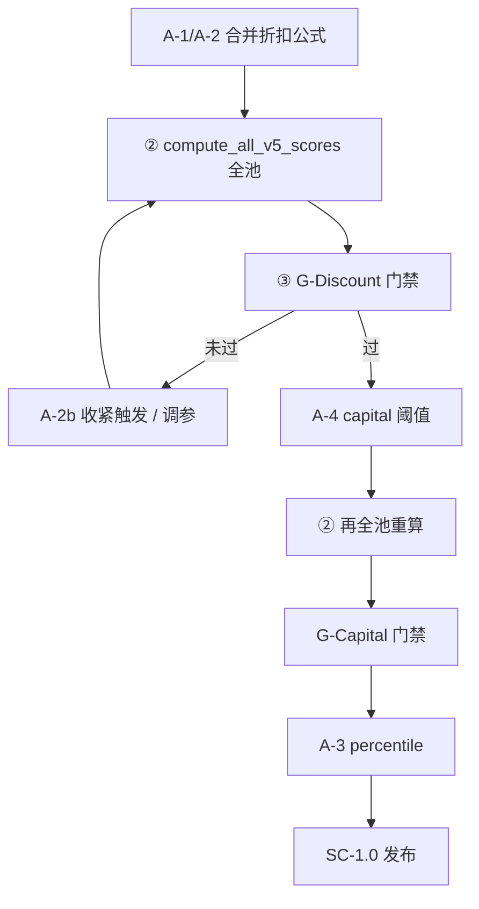
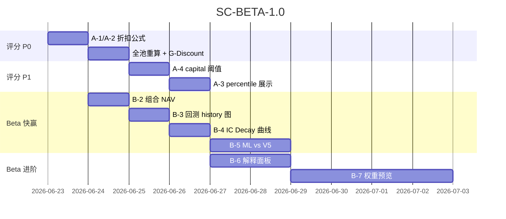

# 评分校准 + Beta 功能改进 — 执行方案书

> **版本**：SC-BETA-1.1（评审修订）  
> **定位**：修复 V5 折扣公式 Bug，恢复分数可解释性与分布；补齐 Beta 实验模块可视化  
> **预估工时**：评分校准 ~3d · Beta 快赢 ~5d · Beta 进阶 ~7d（B-7 调至 4d）  
> **配套**：`UPGRADE_STRATEGY_v3_V5_ONLY.md` · `SCORING_GLOSSARY.md` · `PRODUCT_COMPLETENESS_STRATEGY.md`

---

## 目录

1. [问题摘要与数据验证](#一问题摘要与数据验证)
2. [Part A — 评分系统校准](#part-a--评分系统校准)
3. [Part B — Beta 功能改进](#part-b--beta-功能改进)
4. [排期与依赖](#四排期与依赖)
5. [验收门禁](#五验收门禁)

---

## 一、问题摘要与数据验证

### 1.1 本地库实测（2026-06-22，`data/afr.db`）

| 指标 | 实测 | 与你描述的对照 |
|------|------|----------------|
| 有 V5 分的股票 | 30 只（全池 107） | 样本偏少，需全池重算后复验 |
| composite_v5 最高 | **62.25**（002472） | ✅ 天花板 ~62 |
| composite_v5 = 0 | **3** 只 | 你报 12 只（全池重算后可能更多） |
| veto_status = discount | **27/30（90%）** | 你报 27/99（27%）— 方向一致，比例因样本不同 |
| Top 10 全部 discount | ✅ | ✅ |
| capital_score = 0 | **9** 只 | 接近你报的 12 |

**归零典型路径（000768 中航西飞）**：

```text
base_score ≈ 37.75
− shortboard_penalty 26（含 quality tier=-2）
= raw ≈ 11.75
→ quality_minus2 折扣：×0.6 − 10 = −2.25 → clamp 0
```

代码位置：`backend/services/v5_scorer.py` → `_apply_veto_discounts()` · `check_veto()`

```525:540:backend/services/v5_scorer.py
def _apply_veto_discounts(
    composite: float,
    *,
    quality_minus2: bool = False,
    ...
) -> float:
    result = composite
    if quality_minus2:
        result = result * 0.6 - 10.0
    ...
    return max(0.0, result)
```

**双重惩罚结构**：

| 层 | 机制 | 000768 量级 |
|----|------|-------------|
| 1 | 短板惩罚 `_shortboard_penalty` | tier=-2 → +10，多维度累进至 26 |
| 2 | veto discount | ×0.6 − 10 再砍一刀 |

两层叠加后，raw 本已 <20 的分几乎必归零。

### 1.2 分数天花板根因（结构性，非 Bug）

五档映射：`tier ∈ {-2,-1,0,1,2} → {0,25,50,75,100}`（`tier_to_pct`）

- 十维加权 + 短板封顶 30 → **base_score 理论上限 ~70**
- 再叠 discount → 有效区间压缩到 **0~62**
- **后端公式可不改**；展示层用 **percentile rank** 映射 0~100（见 A-3）

### 1.3 已有能力（避免重复建设）

| 能力 | 状态 |
|------|------|
| 个股 30 日评分趋势 | ✅ `ScoreTrendChart` 已在详情页「评分」Tab |
| 趋势 API | ✅ `GET /scores/trend/{id}` |
| 行业均分叠加 | ✅ ScoreTrendChart 已有 |
| IC Decay API | ✅ `GET /factors/{id}/decay` |
| ML 预测 API | ✅ `factors?tab=ml` 有表格，缺 V5 对比 |
| 组合 compare 曲线 | ✅ `BetaDualChart` 在 compare Tab |
| breakdown 数据 | ✅ `v5_breakdown_json` 已落库 |
| 自定义权重 API | ⚠️ `PUT /scores/factor-weights` 为**旧八维五因子**，非 V5 十维 |

---

## Part A — 评分系统校准

### 优先级总览

| ID | 问题 | 优先级 | 工时 | 改动面 |
|----|------|--------|------|--------|
| A-1 | quality=-2 折扣公式 Bug（×0.6−10 归零） | 🔴 P0 | 0.5d | `v5_scorer.py` + 测试 |
| A-2 | discount 覆盖率过高（蓝筹误伤） | 🟠 P0 | 0.5d | 同上 + 门禁 |
| A-3 | 分数天花板 / 展示归一化 | 🟡 P1 | 1d | API + 前端 |
| A-4 | capital tier 过严 | 🟡 P1 | 1d | **`capital_tier_v5.py`（主路径）** + 阈值常量同步 |

---

### A-1 · 去掉固定 −10，修复归零 Bug（P0，~0.5d）

**目标**：消除「短板已扣 26 分再 ×0.6−10」导致的非预期归零。

**改动**（`v5_scorer.py`）：

```python
# 前
if quality_minus2:
    result = result * 0.6 - 10.0

# 后（A-1 + A-2 合并）
QUALITY_MINUS2_MULT = 0.70  # 可配置 config.V5_QUALITY_DISCOUNT_MULT

if quality_minus2:
    result = result * QUALITY_MINUS2_MULT  # 无减法项
```

**同步更新**：

- `check_veto` 文案：`质量因子=-2(折扣×0.70)`
- `test_v5_scorer.py`：000768 类 case 断言 composite_v5 > 0
- `docs/SCORING_GLOSSARY.md` 折扣表

**000768 修复后估算**：

```text
raw ≈ 11.75 × 0.70 ≈ 8.2（不再归零；仍偏低，符合 quality=-2 语义）
```

> 若仍嫌过低，在 A-2 讨论是否 quality=-2 **仅标 discount 不乘系数**（仅警告），但建议先 0.70 上线看分布。

---

### A-2 · 降低 discount 误伤率（P0，~0.5d）

**现状**：`quality tier <= -2` 即触发（`_quality_tier` 对 CFO/NP 偏严，蓝筹也可能 -2）。

**策略（分两步）**：

#### 步骤 1 — 乘数校准（与 A-1 同 PR）

| 参数 | 现值 | 目标 |
|------|------|------|
| quality_minus2 | ×0.6 − 10 | **×0.70** |
| market_minus2 | ×0.7 | 保持 |
| macro_cold | ×0.8 | 保持 |

**发布门禁 G-Discount**（⚠️ **必须在 A-1 合并且全池重算之后**验收，见 [A · 发布流程](#a--发布流程)）：

- [ ] discount 占比 **≤ 20%**（现 90%@30样本 → 目标 <20%@全池）
- [ ] composite_v5 = 0 **≤ 2%**
- [ ] Top 10 中 discount **≤ 4 只**（允许质量真有问题，但不全榜打折）

> **禁止**用 A-1 合并前的 `comprehensive_scores` 快照跑 G-Discount——旧 composite_v5 仍含 `×0.6−10`，会导致误拒/误放。

#### 步骤 2 — 触发条件收紧（可选，A-2b，+0.5d）

若 G-Discount 未达标，将 quality veto 从 `tier <= -2` 改为：

```python
# 仅当 quality=-2 且 至少一项硬指标极差
if q == -2 and (cfo_np < 0.3 or accrual > 0.15):
    discounts["quality_minus2"] = True
```

数据来自 `v5_quality_metrics` / breakdown，避免「略低质」误触。

---

### A-3 · 展示归一化（P1，~1d）

**原则**：**后端 composite_v5 不改**（排序、回测、组合仍用 raw）；前端增加 **相对分**。

**后端**（~0.25d）：

```text
GET /api/scores/percentile-ranks
→ { stock_id: { raw, percentile, pool_size } }
```

- 计算：active 池内 `composite_v5` 的 percentile rank × 100
- 写入：可选缓存列 `score_percentile`（migration v35）或 API 实时算

**前端**（~0.75d）：

| 位置 | 展示 |
|------|------|
| 列表/排名 | `62 · 前 8%` 或双行 raw + 归一化 |
| V5ScorePanel | 标题旁 `相对分 92/100` |
| 热力图 | 切换 raw / percentile |

**门禁 G-Display**：归一化后 Top 1 显示 ≥ 95；分布近似均匀（KS 目视即可）。

---

### A-4 · capital 打分放宽（P1，~1d）

#### 代码路径（已核实）

| 文件 | 函数 | V5 是否走此路径 | 阈值 |
|------|------|-----------------|------|
| **`capital_tier_v5.py`** | `_tier_main_flow` | ✅ **是**（`compute_stock_v5_tiers` → `compute_capital_tier_v5`） | `-5e7` |
| `v5_scorer.py` | `_capital_tier_from_flow` | ❌ **否**（定义存在但未调用，遗留） | `-5e7` |
| `mood_scorer.py` | `_capital_tier_from_flow` | ⚠️ 情绪 flip 逻辑用 | `-5e7` |

**执行时主改**：`backend/services/capital_tier_v5.py` → `_tier_main_flow`。

**同步**（避免阈值漂移）：

- 阈值抽到 `config.V5_CAPITAL_FLOW_MINUS2_THRESHOLD`，`capital_tier_v5` 引用
- `mood_scorer._capital_tier_from_flow` 改读同一常量
- `v5_scorer._capital_tier_from_flow`：删除或改为 import 共享函数（非 V5 主路径，低优先级）

**现状**：`main_net_5d < -5e7 → tier -2`（约 5000 万净流出）。震荡市里中等市值股极易触发 → `capital_score=0`（tier_to_pct(-2)=0）。

**改动方案**（推荐组合）：

| 项 | 现值 | 建议 |
|----|------|------|
| main_flow -2 阈值 | -5e7 | **-1.5e8**（1.5 亿，经 `config`） |
| main_flow -1 阈值 | <0 | 保持 |
| 多源融合 | 40% 权重 | 单源 -2 时 **降权**（需 ≥2 源同向才 -2） |

文件：`backend/services/capital_tier_v5.py` · 测试 `test_capital_tier_v5.py`

**A-4 后须再跑** `compute_all_v5_scores()`，再验 G-Capital（同 A-1 硬顺序）。

**门禁 G-Capital**：

- [ ] capital_score=0 占比 **≤ 5%**
- [ ] 600519 / 000333 等蓝筹 capital tier **≥ -1**

---

### A · 发布流程

#### 硬顺序依赖（SC-1.1 新增，不可跳过）

```text
① A-1/A-2 代码合并（_apply_veto_discounts ×0.70，无 −10）
        ↓ 阻塞
② compute_all_v5_scores() 全池重算（107 只 active）
        ↓ 阻塞
③ audit_v5_distribution.py → G-Discount 门禁
        ↓ 通过
④ A-4 capital 阈值（可选 A-2b）→ 再跑 ②③
        ↓
⑤ A-3 percentile / Beta 并行
        ↓
⑥ SC-1.0 发布
```

| 步骤 | 动作 | 失败则 |
|------|------|--------|
| ② | **全池 V5 重算** | 禁止进入 ③；不得用旧数据验收 |
| ③ | G-Discount | 回滚或上 A-2b；**不得发布** |
| A-4 后 | 再跑 ②③ | G-Capital 基于新 capital tier |



**必跑命令**（步骤 ②，A-1 合并后**立即**执行）：

```bash
cd backend
python -c "from services.v5_scorer import compute_all_v5_scores; print(compute_all_v5_scores())"
python scripts/audit_v5_distribution.py   # 步骤 ③；新建：discount/zero/max 统计
```

**audit 输出示例**（G-Discount 判定输入）：

```json
{ "pool": 107, "scored": 107, "discount_pct": 18.7, "zero_pct": 1.9, "top10_discount": 3, "max_score": 68.2 }
```

---

## Part B — Beta 功能改进

### 优先级总览

| ID | 功能 | 难度 | 工时 | 现状 |
|----|------|------|------|------|
| B-1 | 个股评分趋势 | 低 | **已有** | 详情页评分 Tab 内，可提升首屏 |
| B-2 | 组合净值曲线 | 低 | 1d | compare Tab 有图，holdings 缺 |
| B-3 | 回测 history 柱状对比 | 低 | 1d | 仅文字列表 |
| B-4 | IC Decay 曲线 | 低 | 1d | API+表格有，缺折线图 |
| B-5 | ML vs V5 对比 | 低 | 1.5d | ml tab 空壳感 |
| B-6 | 维度得分解释面板 | 中 | 2d | breakdown 未暴露 |
| B-7 | V5 权重实时预览 | 中 | **4d** | 旧 factor-weights 不对路；滑块+preview 联动复杂 |

---

### B-1 · 个股评分趋势（~0.5d 抛光，非从零）

**已有**：`RightSidebarTabs` → `ScoreTrendChart`（默认 30 天，可切换 7/90，行业均分）。

**改进**（抛光即可）：

- 左侧主栏 K 线下方增加 **缩略 sparkline**（`ScoreSparkline`），点击滚到右侧评分 Tab
- 无历史数据时引导「数据页 → 重算 V5」
- 默认展示 **composite_v5** 单线（已实现）

---

### B-2 · 组合净值曲线（~1d）

**现状**：`portfolio/page.tsx` holdings Tab 只有 Stat 卡片 + 持仓表；`compare` Tab 已有 `BetaDualChart`。

**实现**：

```text
GET /api/portfolio/{id}/nav-series?days=90
→ { dates[], nav[], benchmark[] }  # 等权持仓 Mark-to-market
```

- 数据源：`portfolio_positions` + `stock_daily_quotes`
- UI：holdings Tab 顶部插入 `BetaDualChart`（组合 NAV vs 沪深300）
- 复用 `portfolio` compare 已有曲线组件样式

**验收**：有持仓的组合 90 日 NAV 曲线可交互；空组合显示占位。

---

### B-3 · 回测多次结果对比（~1d）

**现状**：`backtest/page.tsx` history Tab 纯文字。

**实现**：

- 选中 history runs（checkbox 最多 5 条）
- `Recharts` 分组柱状图：X=run#，Y=总收益 / Sharpe（双轴或 Tab 切换）
- 可选：叠加 `daily_values` 归一化曲线（与 single Tab 一致）

**API**：现有 `GET /api/backtest/history` 已含 `total_return_pct` · `sharpe`，无需改后端。

---

### B-4 · IC Decay 曲线（~1d）

**现状**：`factors?tab=decay` 有 API `analyze_factor_decay`，UI 为表格。

**实现**：

- 新建 `IcDecayChart.tsx`：X=lag(1/5/10/20)，Y=mean_ic，多因子可选 3 条对比
- 因子 IC Tab 增加入口：「查看衰减曲线 →」
- 批量：`GET /api/factors/ic-decay-batch?factors=F001,F002&lags=1,5,10,20`（可选，减少 N 次请求）

**验收**：选 F001 显示 4 点折线；样本不足显示 API error 文案（已有）。

---

### B-5 · ML 预测 vs V5 分（~1.5d）

**现状**：`factors?tab=ml` 仅 ML score 三列表。

**实现**：

```text
GET /api/qlib/predictions?limit=50&with_v5=1
→ [{ code, name, ml_score, composite_v5, delta, veto_status }]
```

- 表格增列：V5 综合 · 差值 · 散点图（ML vs V5）
- 高亮 |delta|>15 的标的（模型与规则分歧）
- 行点击 → `/stocks/{code}`

---

### B-6 · 评分解释面板（~2d，稍复杂）

**数据**：`v5_breakdown_json` 含 `tiers` · `tier_sources` · `capital_breakdown` · `veto_reasons` · `effective_weights`

**UI**：

- `V5ScorePanel` 十维行 **可点击** → `Sheet/Drawer`
- 内容按维度：
  - quality：CFO/NP、accrual、触发 tier 规则
  - capital：`capital_breakdown` 四源子档
  - 其他：`tier_sources` + 一句 `V5ScoreExplainer` 扩展
- 复用 `V5ScoreExplainer.tsx`，补充 tier=-2 文案

**API**：现有 `GET /api/v5/scores/{id}` 已够，纯前端。

---

### B-7 · V5 权重实时预览（~4d，稍复杂）

**澄清**：`PUT /scores/factor-weights` 调整的是 **旧八维五因子权重**，**不影响 composite_v5**。本项需新接口。

**工时构成**（4d）：

| 子项 | 工时 |
|------|------|
| `POST /v5/weights/preview` + 复用 `_weighted_base` | ~1d |
| 十维滑块 UI + 权重归一化 | ~1d |
| 防抖实时 preview + Top N 排名表 | ~1.5d |
| 导出 JSON + 边界测试（权重和≠1） | ~0.5d |

**设计**：

```text
POST /api/v5/weights/preview
Body: { weights: { fundamental: 0.20, quality: 0.15, ... }, stock_ids?: [] }
→ { ranking: [{ stock_id, code, score_before, score_after, delta }] }
```

- 服务端复用 `_weighted_base` + `_shortboard_penalty`（不跑全量 fetch）
- 前端：`/screener` 或新页「权重实验」— 十维滑块 + Top 20 排名实时刷新
- **不写库**；「应用」按钮仅 export JSON（研究员本地实验）

---

## 四、排期与依赖

### 4.1 Gantt



> **A-1/A-2 与 B-2~B-4 可并行**（不同模块）。

### 4.2 工时汇总

| 包 | 工时 |
|----|------|
| 评分 P0（A-1/A-2 + 重算） | ~1.5d |
| 评分 P1（A-3/A-4） | ~2d |
| Beta 快赢（B-1~B-5） | ~5d |
| Beta 进阶（B-6/B-7） | ~6d（B-7=4d） |
| **SC-1.0 最小发布** | **~8.5d**（P0+P1+Beta快赢，不含 B-6/B-7） |

### 4.3 依赖

| 项 | 依赖 |
|----|------|
| **G-Discount** | **硬依赖**：A-1 合并 → `compute_all_v5_scores` 全池 → `audit_v5_distribution`（禁止跳步） |
| G-Capital | A-4 合并 → 再全池重算 → audit |
| B-2 NAV | 行情覆盖率（DataHealth） |
| B-5 ML | `AFR_QLIB_ENABLED=true` + 预测任务已跑 |
| A-3 percentile | `v_stock_scores` 有分（建议在 G-Discount 通过后的重算快照上算） |

---

## 五、验收门禁

### SC-1.0 发布清单

**评分**

- [ ] A-1：`×0.6-10` 已移除；无 `-10` 减法项
- [ ] A-2：quality_minus2 = **×0.70**；G-Discount 通过
- [ ] 000768 类：composite_v5 **> 0**（除非 exclude）
- [ ] A-4：capital_score=0 **≤ 5%**
- [ ] A-3：列表/详情展示 percentile

**Beta**

- [ ] B-2：组合 holdings NAV 曲线
- [ ] B-3：回测 history ≥2 条可柱状对比
- [ ] B-4：IC Decay 折线图（≥1 因子）
- [ ] B-5：ML 表含 V5 列 + 散点

### 回归测试

```bash
cd backend
pytest tests/test_v5_scorer.py tests/test_capital_tier_v5.py -q
pytest tests/test_api.py::test_scores_trend_v5 -q
```

---

## 六、立即下一步

1. **A-1/A-2**（1d）：改 `_apply_veto_discounts`  
2. **② 全池重算**（A-1 合并后**立即**，阻塞）：`compute_all_v5_scores()`  
3. **③ G-Discount**：`audit_v5_distribution.py` — 通过后再做 A-4 / A-3 / Beta  
4. **B-2**（1d）：可与 ②③ 并行，但勿用旧分做评分相关验收  

---

## 附录 A：评审记录（SC-BETA-1.1）

| 项 | 结论 |
|----|------|
| A-1 根因 + 修复 | ✅ 可直接执行 |
| A-2 门禁 | ✅ ≤20% discount / ≤2% 归零 |
| A-3 percentile | ✅ 后端不动 |
| A-4 文件位置 | ✅ `capital_tier_v5.py` 为主路径；`v5_scorer._capital_tier_from_flow` 为遗留未调用 |
| B-1~B-5 | ✅ 工时合理 |
| B-7 | ⚠️ 调至 **4d** |
| 发布顺序 | ✅ ② 全池重算锁死在 A-1 之后、G-Discount 之前 |

---

## 附录 B：配置项建议

```python
# config.py 新增
V5_QUALITY_DISCOUNT_MULT = float(os.getenv("V5_QUALITY_DISCOUNT_MULT", "0.70"))
V5_CAPITAL_FLOW_MINUS2_THRESHOLD = float(os.getenv("V5_CAPITAL_FLOW_MINUS2", "-1.5e8"))
V5_SCORE_DISPLAY_PERCENTILE = os.getenv("V5_SCORE_DISPLAY_PERCENTILE", "true").lower() == "true"
```

---

*文档维护：SC-BETA-1.1 · A-1 合并后必须先全池重算再验 G-Discount。*
