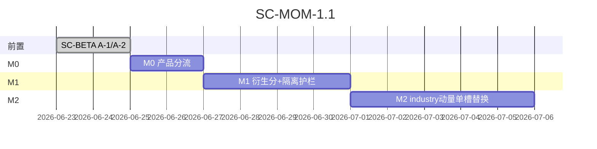

# 价值锚 vs 预期差 — 双轨评分与板块轮动改进方案书

> **版本**：SC-MOM-1.2（M1 折扣与验收阈值修订）  
> **定位**：在 `composite_v5`（价值/质量锚）之外，补齐**动量/轮动/预期差**信号，解决「银行分高但不涨、科技涨但分不高」的体感错位  
> **原则**：**不替换** v3 权威分；新增 **策略画像（Profile）** 与 **合成视图**，各取所长  
> **预估工时**：M0 ~2d · M1 ~4d · M2 ~5d · ~~M3~~ 暂缓  
> **前置**：`SC-BETA-1.1` 折扣校准（A-1/A-2）应先完成，否则两套分数都建立在失真分布上

---

## 目录

1. [问题诊断](#一问题诊断)
2. [设计原则](#二设计原则)
3. [现状盘点](#三现状盘点已有能力)
4. [目标架构](#四目标架构)
5. [Phase M0](#phase-m0--产品分流2d)
6. [Phase M1](#phase-m1--动量画像分4d)
7. [Phase M2](#phase-m2--industry-动量子分替换5d)
8. [M3 暂缓说明](#m3-暂缓说明)
9. [排期与验收](#九排期与验收)

---

## 一、问题诊断

（同 SC-MOM-1.0，略）

**结论**：V5 回答「长期质量/便宜程度」；市场短期定价「变化速度/预期差」。

---

## 二、设计原则

### 2.1 双轨而非单轨替换

```text
composite_v5       → 价值锚 — v3 权威分、组合/预警/回测默认
composite_momentum → 预期差 — 仅展示 + Screener 显式筛选
composite_dividend → 红利持有 — 同上，隔离存储
```

### 2.2 持有 vs 买入信号分离

| 用户意图 | Profile | 消费场景 |
|----------|---------|----------|
| 持有 / 红利 | `value` / `dividend` | 研究、价值 Screener |
| 买入 / 轮动 | `momentum` | 动量 Screener、Dashboard 轮动榜 |
| 均衡 | 默认 `composite_v5` | 组合建仓、score_alerts、Top N |

### 2.3 权威分隔离红线（SC-MOM-1.1 新增）

**`stock_score_profiles` 与 `comprehensive_scores` 必须物理/逻辑隔离**——衍生分**不得**渗入现有决策链。

#### ✅ 允许使用 `?profile=momentum|dividend` 的路径

| 消费者 | 说明 |
|--------|------|
| `GET /api/v5/scores/{id}?profile=` | 详情展示 |
| `GET /api/v5/ranking?profile=` | 动量/红利排行榜 |
| `GET /api/screener/query?profile=` | **显式**传 profile 的筛选 |
| Dashboard 轮动榜 / 详情画像提示 | 只读展示 |

#### ❌ 禁止默认读 profile 分的路径（必须 `composite_v5` / `v_stock_scores.score`）

| 消费者 | 代码位置 |
|--------|----------|
| 组合 Top N 建仓 | `portfolio_svc.build_from_top_n` → `select_top_n_dicts` |
| 持仓 score 预警 | `portfolio_svc.score_alerts`（`composite_v5 < threshold`） |
| 触发式调仓 / replace | `portfolio_svc` rebalance 链路 |
| 回测默认策略 `composite` | `backtest_engine` · `strategy_selector` |
| V5 分数变动预警 | `score_change_log` / `score_alert` |
| `v_stock_scores` 视图 | `score` 列 **永远** = `composite_v5` |

#### 接口层约定

```text
# 默认 — 权威分（现有行为）
GET /api/v5/ranking              → composite_v5
GET /api/screener/query          → 主表 v_stock_scores.score

# 显式 — 衍生分（opt-in）
GET /api/v5/ranking?profile=momentum
GET /api/screener/query?profile=momentum&score_min=60

# 禁止 silent default
❌ 不得在 screener / ranking 省略 profile 时 fallback 到 momentum
❌ 不得在 build_from_top_n 增加 profile 参数（除非用户显式选 strategy=momentum 且仍读权威分）
```

**实现护栏**：

- `stock_score_profiles` **无** FK 到视图；`v_stock_scores` **不 JOIN** profile 表
- Code review grep：`stock_score_profiles` 仅出现在 `v5_scorer` · `v5_data` · `screener`（profile 参数分支）
- 单测：`test_profile_isolation.py` — 断言 `build_from_top_n` / `score_alerts` SQL 不含 `stock_score_profiles`

### 2.4 板块轮动：替换 industry 动量子分，不叠维

- M2 **只改** `_industry_tier` 内部动量 **一个** 槽位
- **禁止** 同时保留 `rs_csi300_20d` + `20d 行业涨幅排名` + 单日 `_sector_momentum_tier` 三者 median（2× 动量敏感度）
- **不新增** 第十维 `rotation`

---

## 三、现状盘点（已有能力）

| 能力 | 位置 | 问题 |
|------|------|------|
| industry 动量 A | `rs_csi300_20d` → `flow_tier` | 20 日相对强度 |
| industry 动量 B | `_sector_momentum_tier` | **单日**涨跌，EPS fallback |
| 行业 5/20 日轮动 | `sector_rotation.py` | 未进 `_industry_tier` |

**M2 目标**：A 与 B **合并为单一** `price_momentum_tier`（20d 行业涨幅排名优先，RS 作 fallback）。

---

## 四、目标架构

```mermaid
flowchart TB
    subgraph tiers [十维 Tier — 共用，仍 10 维]
        F[fundamental] Q[quality] V[valuation]
        C[capital] T[technical]
        I["industry (eps + price_momentum 单槽)"]
        ME[market_env]
    end

    tiers --> W1[V5_WEIGHTS → composite_v5]
    tiers --> W2[V5_PROFILE momentum weights]
    tiers --> W3[V5_PROFILE dividend weights]

    W1 --> CS[(comprehensive_scores)]
    W2 --> SP[(stock_score_profiles)]
    W3 --> SP

    CS --> VS[v_stock_scores.score 权威]
    SP --> API2["API ?profile= 仅 opt-in"]

    VS --> PF[组合/预警/回测默认]
    API2 --> UI[展示/Screener 显式]
```

```sql
-- migration v36 — 与 comprehensive_scores 隔离
CREATE TABLE stock_score_profiles (
  stock_id INTEGER NOT NULL,
  calc_date TEXT NOT NULL,
  profile TEXT NOT NULL CHECK(profile IN ('momentum','dividend')),
  score REAL NOT NULL,
  breakdown_json TEXT,
  PRIMARY KEY (stock_id, calc_date, profile)
);
-- 注意：v_stock_scores 视图不得 JOIN 此表
```

---

## Phase M0 — 产品分流（~2d）

（同 1.0：Screener 预设 · 详情提示 · Dashboard 双榜 — 均用现有维度假拼接，零落库）

---

## Phase M1 — 动量画像分（~4d）

### M1-1 · Profile 权重表

```python
V5_PROFILE_WEIGHTS = {
    "value": V5_WEIGHTS,
    "momentum": {
        "technical": 0.25,
        "capital": 0.22,
        "industry": 0.20,   # M2 前仍用现 industry tier；M2 后自动受益
        "fundamental": 0.08,
        "quality": 0.07,
        "valuation": 0.05,
        "market_env": 0.05,
        "policy": 0.04,
        "news": 0.02,
        "mood": 0.02,
        # 无 rotation 维 — M2 不进新维
    },
    "dividend": { ... },
}
```

### M1-2 · 衍生分落库（隔离写入）

- 写入路径：`compute_all_v5_scores` 末尾 → **仅** `stock_score_profiles`
- **禁止**写回 `comprehensive_scores.composite_v5`

#### momentum profile 的 quality_minus2 折扣（上线即定，不做 A/B 待定）

| Profile | quality_minus2 | 说明 |
|---------|----------------|------|
| **value**（composite_v5） | **×0.70** | 与 SC-BETA A-2 一致，价值锚严格 |
| **momentum** | **×0.85** | 比 value 宽松，**仍保留惩罚** |
| **dividend** | **×0.70** | 与 value 一致，红利股质量门槛不低 |

**禁止** momentum profile 跳过 quality_minus2——否则会筛出一批「技术面强、基本面烂」的标的（高 technical/capital、低 quality 仍进 Top N）。

```python
# v5_scorer.py — profile 折扣分支（示意）
PROFILE_QUALITY_DISCOUNT = {
    "value": config.V5_QUALITY_DISCOUNT_MULT,      # 0.70
    "momentum": config.V5_MOMENTUM_QUALITY_DISCOUNT_MULT,  # 0.85，默认写死
    "dividend": config.V5_QUALITY_DISCOUNT_MULT,
}
```

配置项（M1 一并落地）：

```python
V5_MOMENTUM_QUALITY_DISCOUNT_MULT = float(os.getenv("V5_MOMENTUM_QUALITY_DISCOUNT_MULT", "0.85"))
```

### M1-3 · API（opt-in only）

```text
GET /api/v5/scores/{id}?profile=momentum|dividend   # 缺省 = composite_v5
GET /api/v5/ranking?profile=momentum                  # 新端点或显式参数
GET /api/screener/query?profile=momentum&...          # screener 独立分支
```

### M1-4 · 隔离验收（与功能验收并列）

**隔离（硬门禁，上线前必须通过）**

- [ ] grep：`portfolio_svc` / `score_alert` / `select_top_n` **无** `stock_score_profiles`
- [ ] `v_stock_scores` DDL 无 profile JOIN
- [ ] ranking 无 `profile` 参数时返回分 = `composite_v5`

**画像区分度（软门禁，先观测再定阈值）**

M1 上线**第一天**跑分布对比，**不在 PR 里写死 20%**：

```bash
python scripts/audit_profile_distribution.py
# 输出：|value − momentum| 分位数、p50/p90、按行业分组、value/momentum Spearman ρ
```

| 观测项 | 用途 |
|--------|------|
| \|Δ\| 分布直方图 | 确认银行 value↑momentum↓、科技反之是否存在 |
| \|Δ\| ≥ N 的占比 | **首日报告后再定 N**（20 可能偏保守或偏松） |
| value vs momentum 全池 Spearman ρ | ρ 过高（>0.85）→ 权重需调；过低（<0.5）→ 检查计算 bug |

**首日报告模板**（写入 `docs/reports/profile_distribution_YYYYMMDD.md`）：

- 全池 \|value − momentum\| 的 p50 / p90 / max
- \|Δ\| ≥ 5 / 10 / 15 的样本占比
- 行业分组：银行 vs 科技 \|Δ\| 中位数
- **评审后确认**正式门禁数字（建议范围 15%–35%，以首日数据为准）

临时通过标准（M1 merge 前）：\|Δ\| p50 ≥ 3 且 银行/科技 \|Δ\| 中位数异号（一正一负）。

---

## Phase M2 — industry 动量子分替换（~5d）

> **落点**：替换 `_industry_tier` 内动量逻辑，**不新增维度**，不与 `rs_csi300_20d` 双计。

### M2-1 · 问题：现行双重动量

现 `_industry_tier`：

```python
eps_tier   # EPS 修正 — 保留（基本面预期，非价格动量）
flow_tier  # rs_csi300_20d — 价格动量 A
# EPS 缺失时 fallback:
_sector_momentum_tier  # 单日 change_pct — 价格动量 B（且窗口不对）
→ median(eps, flow) 或 median(eps, single_day)
```

若再 **叠加** `rotation_tier`（20d 排名），则 industry 对动量 **2× 敏感**。

### M2-2 · 目标结构（替换，非叠加）

```python
def _industry_tier(conn, industry_key) -> tuple[int | None, str]:
    eps_tier = _eps_revision_tier(...)           # 保留
    price_momentum_tier = _industry_price_momentum_tier(conn, industry_key, window=20)
    # 单槽：20d 行业涨幅全市场百分位 → tier
    # fallback：rs_csi300_20d（仅当 20d 样本不足）
    # 删除：_sector_momentum_tier 单日逻辑

    parts = [t for t in (eps_tier, price_momentum_tier) if t is not None]
    return _clamp_tier(round(sum(parts) / len(parts))), src
```

**`_industry_price_momentum_tier`**：

- 复用 `sector_rotation` 内核：`stock_daily_quotes` 按 `industry_sw` 聚合 **20 交易日**收益
- 全行业 `pct_rank` → tier（top 20% → +2，bottom 20% → -2）
- 缓存表 `industry_rotation_daily(industry, trade_date, return_20d, pct_rank)`

### M2-3 · 与 `rs_csi300_20d` 关系

| 场景 | 行为 |
|------|------|
| 20d 行业收益可算（≥5 行业有数据） | **只用** 20d 排名 tier |
| 样本不足 | fallback `rs_csi300_20d` → tier（**二选一**，不 median 两者） |
| EPS 修正存在 | `median(eps_tier, price_momentum_tier)` — 基本面 vs 价格各一半 |

### M2-4 · 策略层（显式 opt-in）

- `sector_rotation` 策略：**可选**按 momentum profile 排序（组合 settings 显式开启）
- 默认 `build_from_top_n(strategy=composite)` **不变**
- `SectorRotationCard` 展示 `price_momentum_tier` 来源标签

### M2-5 · 验收

- [ ] `_sector_momentum_tier`（单日）**已删除或仅测试保留**
- [ ] industry tier 的 breakdown 中动量来源 **≤1 个**（`price_momentum_20d` 或 `rs_csi300_20d`）
- [ ] 科技强势期 industry tier 高于银行（p50 差 ≥1 档）
- [ ] composite_v5 的 industry 维分布未异常放大（对比 M2 前后 std 变化 <30%）

---

## M3 暂缓说明

**原方案**：`market_env` = blend(global_tier, industry_rel_tier)，按 profile 调权重。

**暂缓理由**（评审 SC-MOM-1.1）：

1. **归因困难**：回测时 global 与 ind_rel 同时变动，无法分离贡献
2. **解释成本高**：用户问「为什么 market_env 和大盘感觉不一致」难以一句话说清
3. **增量未证**：M2 已将 20d 行业动量注入 `industry` 维；momentum profile 已提高 industry 权重

**触发再评估条件**（满足其二再立项 M3）：

- [ ] M2 上线 4 周后，用户仍反馈「market_env 区分不了行业」
- [ ] momentum profile Top10 与 industry tier 相关性 <0.4（说明 industry 维仍不够）
- [ ] 有明确 AB 指标（如动量策略 Sharpe +0.1）

** backlog 占位**：`docs/backlog/M3_industry_relative_market_env.md`（可选，暂不写实现）

---

## 九、排期与验收

### 9.1 依赖链

```text
SC-BETA-1.1 → M0（可并行）→ M1 → M2
M3：暂缓，见上
```

### 9.2 Gantt



### 9.3 工时

| Phase | 工时 | 状态 |
|-------|------|------|
| M0 | ~2d | ✅ 可做 |
| M1 | ~4d | ✅ 可做（含隔离单测 ~0.5d） |
| M2 | ~5d | ⚠️ 替换单槽，禁止叠维 |
| ~~M3~~ | ~~4d~~ | ❌ 暂缓 |
| **SC-MOM-1.1 交付** | **~11d** | M0+M1+M2 |

### 9.4 总体验收

- [ ] Profile 隔离：组合/预警/默认回测 **只读** composite_v5
- [ ] `?profile=momentum` 仅 Screener 显式 + 展示 API
- [ ] industry 动量 **单槽** 20d，无 rs+rotation 双计
- [ ] 银行：高 composite_v5 + 相对低 momentum profile
- [ ] 科技：反之，且与 20 日涨幅 rank 相关

---

## 十、FAQ

**Q：sector_rotation 策略能否默认用 momentum 分排序？**  
A：仅组合 settings **显式** `use_momentum_profile=true`；系统默认仍 composite_v5。

**Q：M1 的 momentum 权重里 industry 会不会和 M2 重复计动量？**  
A：M1 用现 industry tier（已有 rs_20d）；M2 **替换** industry 内动量槽，不增加维数；momentum profile 权重不变，但 industry 输入变干净。

**Q：M3 什么时候做？**  
A：见 [M3 暂缓说明](#m3-暂缓说明) 三条触发条件。

---

## 附录 A · 评审记录

| 版本 | 项 | 结论 |
|------|-----|------|
| 1.1 | M1 隔离 / M2 单槽 / M3 暂缓 | 见上文 |
| **1.2** | momentum quality_minus2 | **默认 ×0.85**，不跳过、不 A/B 待定 |
| **1.2** | M1-4 区分度阈值 | 首日分布报告后再定；临时：p50\|Δ\|≥3 + 银行/科技异号 |

---

## 十一、立即下一步

1. **M0**（2d）— 零风险产品分流  
2. **M1**（4d）— 含 `test_profile_isolation` + API opt-in 文档  
3. **M2**（5d）— `_industry_price_momentum_tier` 替换单日逻辑，删双计  

---

*文档维护：SC-MOM-1.2 · momentum quality×0.85 定稿；M1-4 区分度首日观测后定阈。*
