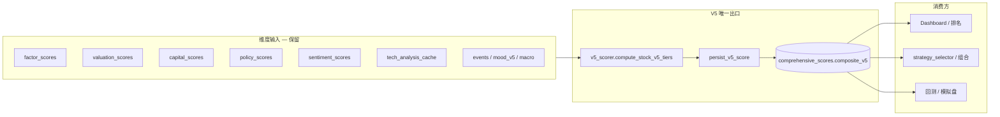
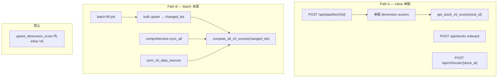
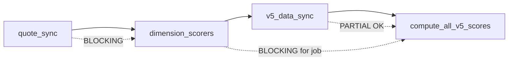
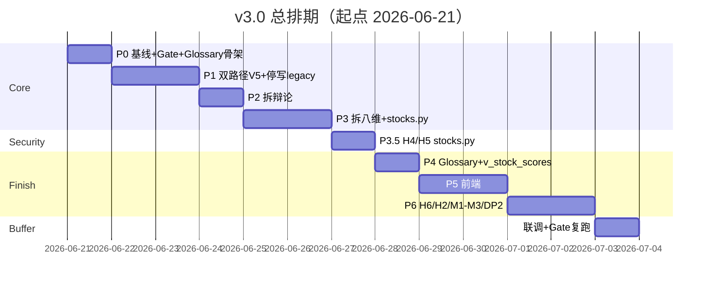

# AI Fundamental Researcher — v3.0 V5 单轨升级总方案

> **版本**：v3.0.2（主方案 + 五项补强 + 执行细节确认）  
> **战略决策**：取消八维综合分（`composite_score`）与 LLM 辩论分（`debate_v2`），全项目以 **`composite_v5` 为唯一权威综合分**。  
> **预估工时**：~26h 核心 + **~2h buffer** ≈ **28h**（P6 安全/管道单独预留 5h）  
> **排期起点**：2026-06-21  
> **目标发布**：v3.0 — V5 Single Source of Truth

---

## 目录

1. [背景与目标](#一背景与目标)
2. [边界定义](#二边界定义取消什么保留什么)
3. [目标架构](#三目标架构)
4. [影响面清单](#四影响面清单)
5. [V5 重算双路径](#五v5-重算双路径补强-1)
6. [调度 DAG 与缺数语义](#六调度-dag-与缺数语义补强-2)
7. [分阶段执行计划](#七分阶段执行计划)
8. [命名消歧与 Glossary](#八命名消歧与-glossary补强-3)
9. [API 契约变更](#九api-契约变更)
10. [发布门禁](#十发布门禁补强-4)
11. [安全与可观测排期](#十一安全与可观测排期补强-5)
12. [审计项 Closure](#十二审计项-closurev5-语境)
13. [风险与回滚](#十三风险与回滚)
14. [排期与交付物](#十四排期与交付物)
15. [立即下一步](#十五立即下一步)

---

## 一、背景与目标

### 1.1 现状问题

项目并行维护 **三套综合分**，带来理解成本、同步 bug 和运维负担：

| 分数 | 来源 | 问题 |
|------|------|------|
| `composite_score` | 八维加权（`config.SCORE_WEIGHTS` + `recompute_composite`） | 与 V5 算法/维度不一致；调度/估值覆盖 |
| `debate_v2.adjusted_score` | LLM 辩论微调 | 只写八维分；与 V5 脱节；`debate_locked` 仍被绕过 |
| **`composite_v5`** | 十维 tier + 短板惩罚 + veto | **已是** Dashboard、选股、回测/模拟盘主路径 |

深度审计中的 **C1（辩论 desync）**、**H1（Dashboard vs 存储权重不一致）** 在 V5-only 路线下通过**删除争议层**根治，而非打补丁。

### 1.2 升级目标（SMART）

| 编号 | 目标 | 验收标准 |
|------|------|----------|
| G1 | **唯一权威分** | 全 API / 前端 / 选股 / 回测只读 `composite_v5` |
| G2 | **无辩论写回** | 无 `/debate/*` 路由；调度不触发 debate batch |
| G3 | **无八维聚合** | 无 `recompute_composite`；`composite_score` 停止写入 |
| G4 | **管道可预期** | 双路径 V5 重算；调度 DAG 明确 BLOCKING/OPTIONAL |
| G5 | **可量化发布** | G-Rank / G-Delta / G-Veto 三门禁脚本全绿 |
| G6 | **语义可维护** | `SCORING_GLOSSARY.md` + `schema_glossary.py` 消歧 |
| G7 | **DB 层强制单轨** | 排名/列表 API 统一查 `v_stock_scores` 视图 |

### 1.3 非目标（本阶段不做）

- 全面重写 PostgreSQL / 微服务
- 33 条 migration 一次性 squash
- 子表 `*.composite_score` 列 rename（v3.1 再评估；v3.0 用 Glossary 消歧）
- 全站 Zod 覆盖（仅核心 API 契约先行）
- 新建独立 `queue_v5_recalc` worker（复用现有 batch-fill job 即可）

### 1.4 与 v2.1（双轨保留）方案对比

| 维度 | v2.1 保留辩论+八维 | **v3.0 V5-only（本方案）** |
|------|-------------------|---------------------------|
| 权威分 | `debate ?? v5 ?? legacy` | **仅 `composite_v5`** |
| C1 修复 | `debate_locked` + ScoreWritePolicy | **删除辩论** |
| H1 修复 | 统一权重来源 | **删除八维聚合** |
| LLM 成本 | 持续 debate batch | **评分路径归零** |
| 长期维护 | 三轨同步 | **单轨** |

---

## 二、边界定义：取消什么、保留什么

### 2.1 取消（聚合 / 辩论层）

```
comprehensive_scores.composite_score   — 八维加权综合分
comprehensive_scores.debate_locked     — 辩论锁
recompute_composite()                  — 八维重算
debate_v2 全链路                       — 表/API/调度/前端
final_score / adjusted_score           — API 对外字段
config.SCORE_WEIGHTS                   — 八维权重
DEBATE_* 环境变量                      — 辩论配置
```

### 2.2 保留（V5 输入层）

维度 scorer 与子表 **必须保留**——V5 从它们计算 tier，不是独立数据源：

```
factor_engine      → factor_scores.composite_score      → V5 fundamental
valuation_scorer   → valuation_scores.composite_score   → V5 valuation
capital_scorer     → capital_scores.composite_score     → V5 capital
policy_scorer      → policy_scores.composite_score      → V5 policy
sentiment          → sentiment_scores.composite_score   → V5 mood（回退）
tech_analysis      → tech_analysis_cache.score            → V5 technical
v5_data_sync       → news/events/mood_v5/macro/industry  → V5 扩展维
comprehensive_scores 维度列（val_score, technical_score 等）→ V5 缓存
```

> **注意**：子表里的 `composite_score` 是**该维度自己的分**，不是八维综合分。语义见 [§八 Glossary](#八命名消歧与-glossary补强-3)。

### 2.3 权威分定义（全项目统一）

```text
score = comprehensive_scores.composite_v5    // 仅此一处，无 fallback
```

API 对外建议统一字段名 `score`（内部映射 `composite_v5`）。

---

## 三、目标架构

### 3.1 评分数据流



### 3.2 标准评分管道（升级后唯一路径）

```text
1. quote_sync / data_fetch
2. dimension_scorers（factor, val, capital, policy, mood, tech）
   → upsert 子表 + comprehensive_scores 维度列（不写 composite_score）
3. v5_data_sync（news, mood_v5, macro, industry — 按模式 skip/执行）
4. compute_all_v5_scores(changed_ids) 或 get_stock_v5_score(stock_id)
   → persist_v5_score → composite_v5 + v5_breakdown_json + veto_status
5. 消费：Dashboard / 选股 / 组合 / 回测
```

---

## 四、影响面清单

### 4.1 后端 — 删除/下线

| 模块 | 路径 | 动作 |
|------|------|------|
| 辩论核心 | `debate_v2.py`, `debate_orchestrator.py`, `debate_context.py`, `debate_prompt.py`, `debate_align.py`, `debate_tiered.py`, `debate_batch.py` | 删除或移入 `legacy/`（打 git tag `pre-v3-debate`） |
| 辩论 API | `api/advanced.py` `/debate/*` | 410 Gone 后移除 |
| 辩论测试 | `test_debate_*.py`, `benchmark_debate_batch.py` | 删除 |
| 八维聚合 | `comprehensive_store.recompute_composite` | 删除 |
| 配置 | `SCORE_WEIGHTS`, `DEBATE_*` | 删除 |
| 因子增量 | `factor_incremental.py` 读 debate | 改读 V5 |

### 4.2 后端 — 修改

| 模块 | 改动 |
|------|------|
| `comprehensive_store.py` | 去掉 `recompute_composite`；`upsert_*` 只写维度列；batch 返回 `changed_ids` |
| `comprehensive.py` | 维度 sync → 收集 `changed_ids` → 调用方 batch V5 |
| `fetch_job.py` | 单股 fetch 完成 → inline `get_stock_v5_score` |
| `job_queue` / batch-fill | job 末尾 `compute_all_v5_scores(changed_ids)` |
| `api/stocks.py` | P3：去 debate JOIN、legacy 字段；P3.5：H4/H5 |
| `api/scores.py` | 去 debate_scores |
| `api/dashboard.py` | overview 仅 V5 |
| `scheduler.py` | 去 debate；按 DAG 跑 v5_data_sync → V5 |
| `score_sql.py` | 改查 `v_stock_scores` 视图（`score` = `composite_v5`） |
| `v5_score_query.py` | 删 `composite_score → composite` 别名 |
| `qlib_train_worker.py` | 读 `composite_v5` |

### 4.3 前端 — 修改

| 位置 | 改动 |
|------|------|
| `lib/api.ts` | 删 debate* 方法；类型去 legacy 字段 |
| `stocks/[code]/page.tsx` | 头部大分仅 `composite_v5` |
| `DimensionDetailPanel.tsx` | 读 V5 breakdown |
| BetaShell / 数据页 | 移除辩论批量 UI |

### 4.4 数据库 — 退役（不立即 DROP）

| 对象 | Phase | 动作 |
|------|-------|------|
| `debate_v2` | P2 停写；P4 归档 | 可选 DROP |
| `comprehensive_scores.composite_score` | P3 停写 | migration 标 DEPRECATED |
| `comprehensive_scores.debate_locked` | P3 停写 | P4 migration 注释 + 删列 |
| `v_stock_scores` | P4 **必选** | 视图暴露 `composite_v5 AS score`；API 统一查询入口 |

---

## 五、V5 重算双路径（补强 1）

### 5.1 原则：两条路径，禁止混用

| 路径 | 触发场景 | 实现 | **禁止** |
|------|----------|------|----------|
| **Path A — Inline** | 单股、用户等待响应 | `get_stock_v5_score(stock_id)` | batch loop 内 inline |
| **Path B — Batch 末尾** | batch-fill、调度、多股 sync | `compute_all_v5_scores(stock_ids=changed_ids)` **一次** | `upsert_dimension_score` 内 inline |

**不引入** `queue_v5_recalc` 独立 worker。复用 `job_queue.enqueue_batch_fill`；V5 作为 job **最后一步**。

### 5.2 触发点映射



| 入口 | 文件 | 行为 |
|------|------|------|
| 单股 fetch | `fetch_job.py` | fetch + 维度后 **inline** V5（1 股） |
| batch-fill | `job_queue` handler | 收集 `changed_stock_ids`，末尾 **1 次** batch V5 |
| bulk sync | `comprehensive.py` | 返回 `changed_ids`，调用方 batch V5 |
| `upsert_dimension_score` | `comprehensive_store.py` | **只写列**，不触发 V5 |

### 5.3 `changed_ids` 规则

- 单股 API：调用方已知 `stock_id`
- batch：`Set[int]` 去重，job 结束统一 V5
- 全市场调度：`changed_ids=None` → 全量（仅 nightly/weekly）

```python
def upsert_dimension_scores_batch(...) -> list[int]:
    """返回本批次 stock_id 列表（去重），供 Path B。"""
```

### 5.4 配置（`config.py`）

```python
SCORING_MODE = os.getenv("AFR_SCORING_MODE", "legacy")  # legacy | v5_only
V5_RECALC_INLINE_ON_SINGLE_FETCH = True   # Path A
V5_RECALC_AT_BATCH_END = True             # Path B
```

### 5.5 Phase 1 验收

- [ ] 单股 fetch 响应含最新 `composite_v5`
- [ ] batch-fill 100 股：`compute_all_v5_scores` 日志 **仅 1 次**
- [ ] `upsert_dimension_score` 内无 V5 调用

---

## 六、调度 DAG 与缺数语义（补强 2 + C2）

### 6.1 调度顺序与阻塞级别



| 步骤 | 级别 | 失败时 | 影响 V5 维 |
|------|------|--------|------------|
| `quote_sync` | **BLOCKING** | job failed，**不跑 V5** | technical, market_env |
| factor/val/capital/tech scorers | **BLOCKING*** | 该维 NULL，**仍跑 V5** | fundamental, valuation, capital, technical |
| `sync_macro` | OPTIONAL | 用 macro 表上次有效值 | market_env |
| `sync_fund_flow` | OPTIONAL | 用 capital 缓存 | capital |
| `sync_industry_l2` | OPTIONAL | industry skip | industry |
| news + event_classification | OPTIONAL | news skip | news |
| `compute_mood_v5` | OPTIONAL | 回退 sentiment_scores | mood |
| `sync_policy_v5` | OPTIONAL | 回退 policy_scores | policy |
| `compute_all_v5_scores` | **BLOCKING**（job 终步） | 写 missing_dims | 全部 |

\* scorer 单维失败不阻断 job，但该维 tier=None。

### 6.2 与现有 `V5_SYNC_MODE_PRESETS` 对齐

| 模式 | 要点 | V5 时机 |
|------|------|---------|
| `daily` | 多数 skip，用缓存 | sync 后 batch V5 |
| `nightly` | 补 news/events，`skip_v5_scores=True` | **下一步**单独 V5 |
| `weekly` | macro/metrics/eps 全跑 | 末尾 `compute_all_v5_scores` 全量 |

### 6.3 维度缺数策略（与 C2 一并实现）

| V5 维 | 首选输入 | 缺数/失败 | 禁止 |
|-------|----------|-----------|------|
| fundamental | factor_scores | skip | 默认 50 |
| quality | v5_metrics | skip | 默认 50 |
| industry | industry_l2 | skip（**不 cache**） | 默认 50 |
| capital | V5 flow → capital_scores | 回退；全无 skip | 默认 50 |
| valuation | val_score → valuation_scores | 回退；全无 skip | 默认 50 |
| technical | tech_analysis_cache | skip | 默认 50 |
| market_env | macro + beta | **last valid macro**；beta 缺 skip | 默认 50 |
| policy | policy_v5 → policy_scores | 回退；全无 skip | 默认 50 |
| news | events | skip（**不 cache**） | 默认 50 |
| mood | mood_v5 → sentiment_scores | 回退；全无 skip | 默认 50 |

**三条铁律**：

1. **Never 50**：scorer 源头返回 `None` → tier skip  
2. **Last valid cache**：仅 macro、capital、valuation、policy、mood（有历史表）  
3. **breakdown 必写**：`v5_breakdown_json` 每维 `{source, status: ok|cached|missing|skipped}`

### 6.4 C3 — PE 截断（P3 同期）

- `valuation_scorer`：`PE_MAX=1000`；EPS≤0 → 不参与 PE 分位  
- breakdown 标 `pe_capped` / `loss_company`

### 6.5 job 返回值扩展

```python
{
  "ok": True,
  "v5_inputs_complete": False,
  "steps": {...},
  "v5_recalc": {"computed": N, "skipped_hard_fail": bool}
}
```

- `quote_sync` hard fail → 不调 V5  
- optional fail → 仍 V5，breakdown 标 partial

---

## 七、分阶段执行计划

### Phase 0 — 基线与清单（~2h）

| 任务 | 产出 |
|------|------|
| P0-1 | `config.SCORING_MODE` 开关（默认 `legacy`） |
| P0-2 | `scripts/snapshot_v5_scores.py` Top100 基线 JSON |
| P0-3 | `scripts/v5_release_gate.py` 框架（三门禁 + allowlist 草稿生成） |
| P0-4 | grep 清单 → `docs/V5_MIGRATION_INVENTORY.md`（三栏：DEPRECATED / DIMENSION / AUTHORITATIVE） |
| P0-5 | `docs/SCORING_GLOSSARY.md` 骨架 + `backend/schema_glossary.py` |

**验收**：基线 + gate 脚本可运行；清单完整。

---

### Phase 1 — 停写 legacy + 双路径 V5（~5h）

| ID | 任务 |
|----|------|
| P1-1 | `DEBATE_WRITE_COMPOSITE=false`；调度不调 debate |
| P1-2 | `upsert_dimension_score` / batch 去掉 `recompute_composite` |
| P1-3 | 实现 Path A（`fetch_job` inline V5）+ Path B（batch-fill 末尾 V5） |
| P1-4 | `upsert_dimension_scores_batch` 返回 `changed_ids` |
| P1-5 | API 双轨：`score=composite_v5`；legacy 字段只读 + `_deprecated` |

**验收**：见 [§5.5](#55-phase-1-验收)。

---

### Phase 2 — 辩论链路拆除（~3h）

| ID | 任务 |
|----|------|
| P2-1 | `/debate/*` → 410 Gone |
| P2-2 | 删 scheduler / fetch 中 debate 触发 |
| P2-3 | 前端删 debate API / UI |
| P2-4 | 归档 `services/debate_*.py`（tag `pre-v3-debate`） |
| P2-5 | 删 debate 测试；CI 绿 |

**验收**：无 `from services.debate_v2` import。

---

### Phase 3 — 八维聚合拆除（~4h）

| ID | 任务 |
|----|------|
| P3-1 | 删 `recompute_composite`、`SCORE_WEIGHTS` |
| P3-2 | 重构 `comprehensive.py`：sync → changed_ids → batch V5 |
| P3-3 | `fetch_job` / batch-fill 流水线对齐 Path B |
| P3-4 | `qlib_train_worker` 等改读 `composite_v5` |
| P3-5 | **`api/stocks.py` 仅此 Phase 改**：去 debate JOIN、legacy 字段 |
| P3-6 | C2/C3 在 scorer 层落地 |
| P3-7 | `SCORING_MODE=v5_only` 时不返回 legacy 字段 |

**验收**：`grep recompute_composite` 零结果；batch 后仅 `composite_v5` 变。

> **文件锁**：P3 合并验收后，才允许 P3.5 改 `stocks.py`。

---

### Phase 3.5 — 安全 H4/H5（~1.5h，串行于 P3 之后）

| ID | 任务 |
|----|------|
| P3.5-1 | H4：`stocks.py` JOIN 白名单 enum，禁 f-string SQL 片段 |
| P3.5-2 | H5：股票代码 `^\d{6}$`（A 股）校验 → 422 |

**验收**：`' OR 1=1--` → 422；与 P3 无 merge conflict。

---

### Phase 4 — Glossary + v_stock_scores 视图（~4h）

| ID | 任务 |
|----|------|
| P4-1 | 完善 `docs/SCORING_GLOSSARY.md` |
| P4-2 | `backend/schema_glossary.py` + `COLUMN_SEMANTICS`（**唯一机器可读语义源，不建 `_schema_meta` 表**） |
| P4-3 | migration v34：`debate_locked` 删列；migration 文件内注释 deprecated 列语义 |
| P4-4 | **必选** 创建视图 `v_stock_scores`（见 [§8.5](#85-v_stock_scores-视图必选)） |
| P4-5 | `score_sql.py` / `stocks.py` / `v5_score_query.py` 排名与列表改查视图 |

**验收**：新人可按 Glossary 区分八维废弃分 vs 维度内部分；grep 业务 SQL 无直接读 `composite_score` 作权威分。

---

### Phase 5 — 前端与类型统一（~3h）

| ID | 任务 |
|----|------|
| P5-1 | `types/stock.ts`：`score: number \| null` |
| P5-2 | 全页去掉 `composite_score` / `final_score` |
| P5-3 | V5 breakdown 为个股唯一综合解读 |
| P5-4 | 重算后 `clearCache` 仅 V5 key |
| P5-5 | 可选 Zod：`composite_v5` + `veto_status` |

---

### Phase 6 — 安全与可观测（~5h，P5 之后）

| ID | 任务 | 估时 | 说明 |
|----|------|------|------|
| P6-1 | H6 前端 API Key | ~1.5h | Next Route Handler 代理 `/api/*` 或 nginx auth；删 `NEXT_PUBLIC_*` |
| P6-2 | H2/H3 错误日志 | ~1h | 统一 `log_error`；激活 `error_logs`；health 暴露 recent count |
| P6-3 | M1 fetch / batch V5 超时 | ~1h | `fetch_job` + `compute_all_v5_scores` 可配置 timeout；前端 poll 可重试 |
| P6-4 | M2 Dashboard `allSettled` | ~0.5h | 局部失败不拖垮 |
| P6-5 | M3 GET 鉴权重收紧 | ~0.5h | 财务/评分路径纳入 key 检查 |
| P6-6 | DP2 job 事务边界 | ~1.5h | fetch → 维度 → V5 单 job 状态机；partial failure 写 steps |

> H4/H5 已在 P3.5 完成，**不与 P3 并行改同一文件**。P6 三项重活（H6 / M1 / DP2）各 ≥1h，**不压缩**。

---

## 八、命名消歧与 Glossary（补强 3）

### 8.1 为何 v3.0 做（不等 v3.1）

子表 `policy_scores.composite_score` 等与废弃八维同名，grep 无法区分。列 rename 波及面广；v3.0 用 **文档 + 代码常量** 消歧。

### 8.2 `docs/SCORING_GLOSSARY.md` 结构

```markdown
## 已废弃（v3 停止写入）
- comprehensive_scores.composite_score — 八维加权综合分 DEPRECATED
- comprehensive_scores.debate_locked — DEPRECATED

## 维度内部分（保留，非八维综合）
- factor_scores.composite_score — 基本面维度分
- policy_scores.composite_score — 政策维度分
- capital_scores.composite_score — 资金面维度分
- sentiment_scores.composite_score — 情绪维度分
- valuation_scores.composite_score — 估值维度分

## 权威综合分（v3 唯一）
- comprehensive_scores.composite_v5 — 十维 tier 综合分
```

### 8.3 `backend/schema_glossary.py`

```python
COLUMN_SEMANTICS = {
    "comprehensive_scores.composite_score": "DEPRECATED eight-dim aggregate",
    "comprehensive_scores.composite_v5": "AUTHORITATIVE composite score",
    "policy_scores.composite_score": "dimension score → policy tier",
}
```

### 8.4 grep 清单三栏

Phase 0 维护 `V5_MIGRATION_INVENTORY.md`：`DEPRECATED` | `DIMENSION_SCORE` | `AUTHORITATIVE`。

### 8.5 为何不建 `_schema_meta` 表

`schema_glossary.py` 的 `COLUMN_SEMANTICS` 已是**唯一机器可读语义源**；再建 DB 表等于维护两份相同 JSON，无额外消费方。

| 需求 | 实现 |
|------|------|
| 开发/审查查语义 | `schema_glossary.py` + `SCORING_GLOSSARY.md` |
| migration 可追溯 | v34 migration 文件顶部注释 deprecated 列 |
| 运行时 schema 版本 | **`GET /api/system/health`** 返回 `scoring_mode` + `schema_glossary_version`（读 Python 常量，不读 DB） |

**不采用** `_schema_meta` 表，除非 v3.1 出现跨进程动态更新 schema 的需求。

### 8.6 `v_stock_scores` 视图（必选）

在 DB 层强制单一权威分，防止新代码直接读 `composite_score`。

```sql
CREATE VIEW IF NOT EXISTS v_stock_scores AS
SELECT
    s.id AS stock_id,
    s.code,
    s.name,
    s.market,
    cs.calc_date,
    cs.composite_v5 AS score,
    cs.composite_v5,
    cs.veto_status,
    cs.v5_breakdown_json,
    cs.quality_score,
    cs.industry_score,
    cs.market_env_score
FROM stocks s
INNER JOIN comprehensive_scores cs ON cs.stock_id = s.id
INNER JOIN (
    SELECT stock_id, MAX(calc_date) AS md
    FROM comprehensive_scores
    WHERE composite_v5 IS NOT NULL
    GROUP BY stock_id
) latest ON cs.stock_id = latest.stock_id AND cs.calc_date = latest.md
WHERE s.is_active = 1;
```

**消费方（P4-5 必须改查视图）**：

| 模块 | 改法 |
|------|------|
| `score_sql.py` | `JOIN v_stock_scores` 替代手写 latest composite_v5 子查询 |
| `api/stocks.py` 列表 | SELECT `score` FROM `v_stock_scores` |
| `v5_score_query.fetch_latest_top_n` | `ORDER BY score DESC` |
| `api/dashboard.py` Top N | 同上 |

**禁止**：业务排名 SQL 直接读 `comprehensive_scores.composite_score` 或裸 `composite_v5`（写入路径除外）。

---

## 九、API 契约变更

### 9.1 Breaking changes（v3.0）

| 变更 | 旧 | 新 |
|------|-----|-----|
| 综合分 | `composite_score`, `final_score`, `adjusted_score` | `score`（= `composite_v5`） |
| 辩论 | `GET/POST /api/debate/*` | **410 → 移除** |
| 排名 | 混用 | `ORDER BY composite_v5 DESC` |

### 9.2 兼容期（2 周，`SCORING_MODE=legacy`）

```json
{
  "score": 72.5,
  "composite_v5": 72.5,
  "_deprecated": {
    "composite_score": "use score",
    "final_score": "removed in v3"
  }
}
```

`SCORING_MODE=v5_only` 时省略 `_deprecated` 与 legacy 字段。

---

## 十、发布门禁（补强 4）

升级前后各跑 `scripts/v5_release_gate.py`，**三门禁全绿**方可发布。

| 门禁 | 条件 | 说明 |
|------|------|------|
| **G-Rank** | Top10 排名变化 ≤3 位 | \|Δrank\|>3 的股票 ≤3 只 |
| **G-Delta** | 无异常跳变 | 交集股票 \|Δscore\|≤15；超出 ≤5 只且在已审批 allowlist |
| **G-Veto** | veto 覆盖率稳定 | \|Δcoverage\|≤5pp；exclude 数变化 ≤10% |

### 10.1 Allowlist 自动生成（不手写 CSV）

`v5_release_gate.py` 在 G-Delta 失败时**自动生成草稿**，人工只做 review + 签字，避免 C2/C3 期间 10–20 股手工审批瓶颈。

**输出文件**（每次 gate 运行）：

```text
docs/reconciliation/allowlist_jump_DRAFT_{date}.csv   # 脚本生成，勿手改
docs/reconciliation/allowlist_jump_APPROVED.csv         # review 后 git 提交
```

**草稿 CSV 列**：

| 列 | 说明 |
|----|------|
| `stock_id`, `code`, `name` | 标识 |
| `score_before`, `score_after`, `delta` | 跳变幅度 |
| `reason_code` | 枚举：`missing_dim_fixed` \| `pe_capped` \| `loss_company_tagged` \| `veto_changed` \| `unknown` |
| `reason_detail` | 来自 `v5_breakdown_json` 或 scorer 日志的自动摘要 |
| `auto_approve` | `true` 若 reason_code 为已知 C2/C3 类且 \|delta\|≤25；否则 `false` 需人工 |

**reason_code 推断规则（脚本内置）**：

```python
# 伪代码
if breakdown.get("valuation", {}).get("pe_capped"):
    reason = "pe_capped"
elif "missing_dims" in diff(before_breakdown, after_breakdown):
    reason = "missing_dim_fixed"
elif before.veto_status != after.veto_status:
    reason = "veto_changed"
else:
    reason = "unknown"  # 必须人工 review
```

**审批流程**：

1. `python scripts/v5_release_gate.py --before baseline.json --after current.json`  
2. 若 G-Delta 失败 → 写 `allowlist_jump_DRAFT_{date}.csv`  
3. 维护者检查 `auto_approve=false` 行，确认后合并到 `allowlist_jump_APPROVED.csv`  
4. 重跑 gate 加 `--allowlist docs/reconciliation/allowlist_jump_APPROVED.csv`  
5. 三门禁全绿 → 可发布

**写入标准**：仅 `reason_code ∈ {missing_dim_fixed, pe_capped, loss_company_tagged, veto_changed}` 且证据列非空时可批准；`unknown` 默认拒绝。

### 10.2 预期跳变（脚本自动标，非人工判断）

| reason_code | 来源 |
|-------------|------|
| `missing_dim_fixed` | C2 |
| `pe_capped` / `loss_company_tagged` | C3 |
| `veto_changed` | veto 规则调整 |
| 辩论移除 | **不应出现**；出现则 gate 硬失败 |

### 10.3 不采用

- ~~「95% 分数变化可解释」~~ — 主观  
- ~~全库平均分偏差~~ — V5 非线性，无意义

---

## 十一、安全与可观测排期（补强 5）

### 11.1 修订 Gantt



### 11.2 文件所有权

| 文件 | 负责 Phase |
|------|------------|
| `api/stocks.py` | P3 → **验收** → P3.5（禁止并行） |
| `comprehensive_store.py` | P1, P3 |
| `middleware.py` | P6 |
| `docs/SCORING_GLOSSARY.md` | P0 骨架, P4 完善 |

---

## 十二、审计项 Closure（V5 语境）

| 原 ID | v3.0 处理 | Phase |
|-------|-----------|-------|
| C1 辩论 desync | 删除辩论 | P2 |
| C2 缺数默认 50 | None + skip | P3 |
| C3 PE 极端值 | clip + loss bucket | P3 |
| H1 权重不一致 | 删除八维 | P3 |
| H2 静默 except | log_error | P6 |
| H3 error_logs 空 | 激活写入 | P6 |
| H4 SQL 注入 | 白名单 JOIN | P3.5 |
| H5 代码校验 | regex 422 | P3.5 |
| H6 API Key | Next 代理 | P6 |
| H7 DB 写瓶颈 | batch 短连接 | P6 |
| M1 超时 | fetch/V5 timeout | P6 |
| M2 Dashboard 容错 | allSettled | P6 |
| M3 GET 鉴权 | 路径收紧 | P6 |
| M4 LLM debate 熔断 | 辩论删除 | P2 |
| M5 时间戳语义 | last_attempt_at | P6 |
| A4 debate/score 无 FK | 辩论删除 | P2 |

### 12.1 方案扫描遗留项（v3.0.3 补丁）

| ID | 问题 | 处理 | 状态 |
|----|------|------|------|
| L1 | `GET /scores/trend/{id}`、`trend-overview` 读 `composite_score` | 改 `COALESCE(composite_v5, composite_score) AS score`；响应 `metric: composite_v5` | ✅ 已修 |
| L2 | `GET /scores/batch` JOIN `debate_v2` 返回 `debate_scores` | 改查 `v_stock_scores`；移除 debate 查询 | ✅ 已修 |
| L3 | `GET /scores/comprehensive`、`/scores/batch` 仍 `ORDER BY composite_score` | 同 L2，统一 `v_stock_scores.score DESC` | ✅ 已修 |
| L4 | UX U1-3 缺 bulk sparkline | 新增 `POST /scores/sparkline` | ✅ 已修 |

**仍待 Phase 4 扫尾**（非阻塞）：`GET /scores/heatmap`、`score_sql.latest_batch_calc_date_subquery` 等仍引用 `composite_score` — 纳入 P4 grep 清单。

---

## 十三、风险与回滚

| 风险 | 缓解 | 回滚 |
|------|------|------|
| 去掉辩论后缺 LLM 解读 | 保留 RAG/研报非评分 LLM | tag `pre-v3-debate` |
| 维度更新未触发 V5 | Path B 强制；health 查 v5 日期 | `SCORING_MODE=legacy` |
| batch V5 变慢 | 增量 `changed_ids` | nightly 全量 |
| API breaking | 2 周 deprecate | 恢复 legacy 字段 |
| P3/P3.5 冲突 | 文件所有权表 | 严格串行 merge |

**每 Phase 前**：`cp data/afr.db data/afr.db.pre-v3.{phase}`

---

## 十四、排期与交付物

### 14.1 工时

| Phase | 工时 | 累计 |
|-------|------|------|
| P0 | 2h | 2h |
| P1 | 5h | 7h |
| P2 | 3h | 10h |
| P3 | 4h | 14h |
| P3.5 | 1.5h | 15.5h |
| P4 | 4h | 19.5h |
| P5 | 3h | 22.5h |
| P6 | 5h | 27.5h |
| Buffer（联调 / gate 复跑） | 2h | **~29.5h** |

> 对外沟通可报 **~28h（含 buffer）**；核心 Phase 合计 ~26h。

### 14.2 建议日历（自 2026-06-21 起）

| 日期 | 交付 |
|------|------|
| 06-21（D1） | P0 + P1 启动 |
| 06-22–23（D2–D3） | P1 完成 + P2 |
| 06-24–25（D4–D5） | P3 + P3.5 |
| 06-26（D6） | P4 Glossary + `v_stock_scores` |
| 06-27–28（D7–D8） | P5 前端 |
| 06-29–30（D9–D10） | P6 |
| 07-01（D11） | Buffer：gate 复跑 + allowlist review → v3.0 |

### 14.3 交付物清单

| # | 交付物 |
|---|--------|
| 1 | 代码：双路径 V5、删辩论/八维、C2/C3 |
| 2 | `scripts/snapshot_v5_scores.py` |
| 3 | `scripts/v5_release_gate.py`（含 allowlist 草稿生成） |
| 4 | `docs/SCORING_GLOSSARY.md` |
| 5 | `backend/schema_glossary.py` |
| 6 | `docs/V5_MIGRATION_INVENTORY.md` |
| 7 | migration v34：`v_stock_scores` 视图 + `debate_locked` 删列 |
| 8 | `docs/reconciliation/allowlist_jump_APPROVED.csv`（review 后） |
| 9 | `.env.example` 更新（`SCORING_MODE`） |
| 10 | Closure checklist 签字 |

### 14.4 总 Closure Checklist

- [ ] 全消费方只读 `composite_v5`
- [ ] Path A / Path B 分离，batch 仅 1 次 V5
- [ ] 无 `recompute_composite`
- [ ] 无 `/debate/*`
- [ ] 调度 DAG BLOCKING/OPTIONAL 文档 + 测试
- [ ] C2/C3 落地
- [ ] G-Rank / G-Delta / G-Veto 全绿
- [ ] Glossary + `schema_glossary.py`（无 `_schema_meta` 表）
- [ ] `v_stock_scores` 视图 + 排名 API 改查视图
- [ ] allowlist 草稿自动生成 + APPROVED 签字
- [ ] P3 → P3.5 串行，无 stocks.py 冲突
- [ ] H4/H5/H6 完成

---

## 十五、立即下一步

1. **P0**（~2h）：基线快照 + `v5_release_gate.py` 框架 + Glossary 骨架 + grep 清单  
2. **P1**（~5h）：双路径 V5 + 停写 `recompute_composite`（API 可暂不改）  
3. 跑 gate 对比基线，确认 Path B 在 batch-fill 只触发一次 V5  
4. **P2** 拆辩论（独立 PR，可并行 review P1）

---

*文档维护：v3.0.2 — 取消 `_schema_meta`；`v_stock_scores` 升为必选；allowlist 自动生成；P6 调至 5h；排期起点 2026-06-21。发布后将 `SCORING_MODE` 默认改为 `v5_only`。*
