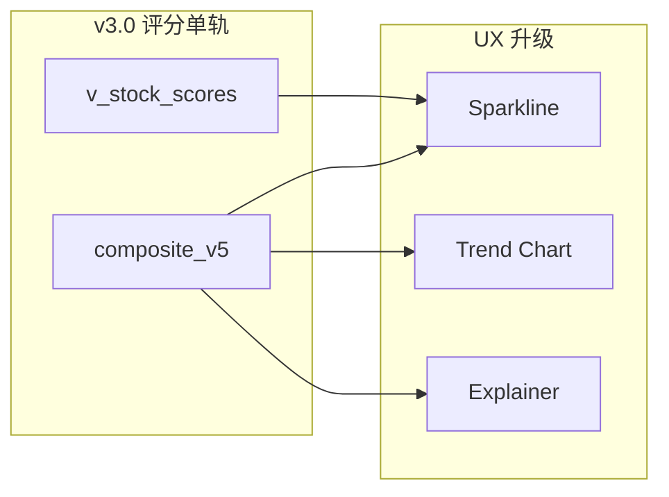
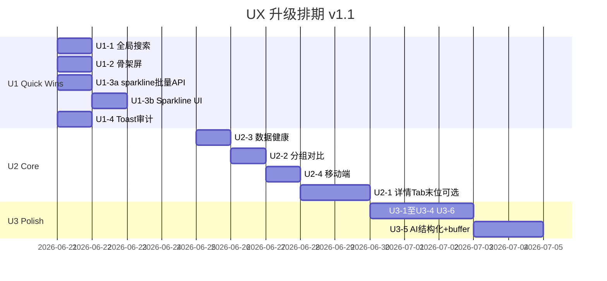

# AI Fundamental Researcher — 体验升级执行方案书

> **版本**：UX-1.1（U2 Tab 工时、Sparkline 批量 API、AI 结构化修订）  
> **排期起点**：2026-06-21  
> **预估工时**：~52h（U1 ~9h · U2 ~22h · U3 ~19h · buffer ~2h）  
> **与 v3.0 关系**：可并行；#3/#9/#14 依赖 `composite_v5` / `v_stock_scores` 完成后数据口径一致  
> **原则**：先感知体验（搜索/骨架/Toast），再结构优化（对比/健康/移动）；**Tab 化最后做或遇瓶颈再做**

---

## 目录

1. [现状与机会](#一现状与机会)
2. [优先级矩阵](#二优先级矩阵)
3. [技术基线](#三技术基线)
4. [Phase U1 — Quick Wins（~8h）](#phase-u1--quick-wins8h)
5. [Phase U2 — 核心体验（~18h）](#phase-u2--核心体验18h)
6. [Phase U3 — 完善与 AI（~16h）](#phase-u3--完善与-ai16h)
7. [组件与 API 规划](#七组件与-api-规划)
8. [与 v3.0 协同](#八与-v30-协同)
9. [排期与交付物](#九排期与交付物)
10. [验收标准](#十验收标准)
11. [v1.1 修订摘要](#十一v11-修订摘要)

---

## 一、现状与机会

### 1.1 已有能力（可复用）

| 能力 | 位置 | 状态 |
|------|------|------|
| Toast 体系 | `lib/useToast.tsx` + `layout.tsx` ToastProvider | 已接入 dashboard/stocks/portfolio 等，**覆盖不均** |
| 暗色切换 | `ThemeProvider` + `Layout` 侧栏按钮（⌘D） | **有入口**，但大量 `text-red-600` 硬编码 |
| 分组 | `GroupManager.tsx` + `/api/groups` | 有分组，无对比视图 |
| 数据状态 | `DataStatusBadge` | 组件存在，Dashboard 未聚合 stale 列表 |
| 评分健康 | `ScoreSyncHealthCard` | 在 data 页，未上 Dashboard |
| 评分趋势 API | `GET /api/scores/trend/{id}` | **仍读 `composite_score`**，需 v3 改 `composite_v5` |
| 趋势概览 API | `GET /api/scores/trend-overview` | 同上 |
| V5 面板 | `V5ScorePanel.tsx` | tiers/breakdown 已有，无自然语言解释 |
| UI  primitives | `dialog` / `tabs` / `table` / `badge` | 无 `cmdk`，Command+K 可用 Dialog+Input 或加依赖 |
| 侧栏快捷键 | `Layout.tsx`：`/` 聚焦首个 input、`⌘D` 主题 | **无 ⌘K 全局搜索** |

### 1.2 核心痛点

```text
发现路径长：必须 /stocks → 过滤 → 点击
详情页白屏：stocks/[code] setState('loading') 无占位
分数无上下文：只有快照，无 7/30 天方向
写操作反馈弱：部分页 mutation 无 toast（portfolio 部分操作、market 同步等）
详情页过重：576 行平铺，首屏 8+ 请求
移动端不可用：ml-56 固定侧栏 + 宽表格
```

### 1.3 升级目标

| 编号 | 目标 | 衡量 |
|------|------|------|
| UX-G1 | 3 秒内到达任意自选股详情 | ⌘K 搜索 ≤2 键 |
| UX-G2 | 感知加载时间降低 | 骨架屏 LCP 主观评分 |
| UX-G3 | 分数可读可行动 | sparkline + 趋势图 + 解释文案 |
| UX-G4 | 写操作必有反馈 | mutation 100% toast |
| UX-G5 | 详情页首屏请求可控 | **U1-2 骨架先解感知**；Tab 懒加载为 U2 可选深化（≤3 XHR） |
| UX-G6 | 手机可读 | Dashboard + 排名 md: 适配 |

---

## 二、优先级矩阵

| # | 功能 | 价值 | 工作量 | Phase | 估时 |
|---|------|------|--------|-------|------|
| 1 | ⌘K 全局搜索 | 🔴 高 | 低 | U1 | 2h |
| 2 | 详情页骨架屏 | 🔴 高 | 低 | U1 | 1h |
| 3 | 综合分 sparkline | 🔴 高 | 低* | U1 | 3h（含批量 API） |
| 4 | Toast 全覆盖 | 🔴 高 | 低 | U1 | 3h |
| 5 | 详情 Tab 化 | 🟡 高 | **高** | U2 **末位/可推迟** | **10h** |
| 6 | 分组一键对比 | 🟡 高 | 中 | U2 | 5h |
| 7 | 数据健康看板 | 🟡 高 | 中 | U2 | 4h |
| 8 | 移动端响应式 | 🟡 高 | 中 | U2 | 3h |
| 9 | 评分历史折线图 | 🟢 完善 | 较大 | U3 | 5h |
| 10 | 筛选器 URL 持久化 | 🟢 完善 | 中 | U3 | 3h |
| 11 | CSV/Excel 导出 | 🟢 完善 | 中 | U3 | 4h |
| 12 | 暗色模式完善 | 🟢 完善 | 较大 | U3 | 4h |
| 13 | AI 摘要结构化 | 💡 AI | **高** | U3 **末尾** | **7h** |
| 14 | V5 得分解释 | 💡 AI | 中 | U3 | 3h |

---

## 三、技术基线

### 3.1 新建共享组件（U1 起）

```text
frontend/components/
  GlobalSearch.tsx          # ⌘K 对话框
  StockDetailSkeleton.tsx   # 详情骨架
  ScoreSparkline.tsx        # 7/30d mini 图（recharts 或纯 SVG）
  ScoreTrendChart.tsx       # 详情/full 折线（U3）
  DataHealthCard.tsx        # Dashboard stale 列表（U2）
  GroupCompareTable.tsx     # N×10 维对比（U2）
  V5ScoreExplainer.tsx      # 规则+可选 LLM 解释（U3）
  ui/skeleton.tsx           # shadcn 风格 Skeleton（若无则新建）
```

### 3.2 API 调整（与 v3 对齐）

| 端点 | 现状 | UX 方案 |
|------|------|---------|
| **`POST /scores/sparkline`** | **已实现** | body=`{ stock_ids, days }` → `{ series: { "id": [{date, score}] } }` |
| `GET /scores/trend/{id}` | **已改 v5** | 返回 `score` + `metric: composite_v5` |
| `GET /scores/trend-overview` | 全市场概览 | 不用于排名页（粒度不对） |
| `GET /api/stocks` | 全量列表 | ⌘K 客户端 filter（≤500 只足够）；后续可加 `?q=` 服务端搜索 |
| Dashboard stale | `GET /api/dashboard/overview` 已有 `stale_stock_list` | U2 直接消费 |

### 3.3 设计 Token（U3 暗色前置）

```tsx
// lib/scoreColors.ts — 替代散落 text-red-600
export function scoreTextClass(v: number | null) {
  if (v == null) return "text-muted-foreground";
  if (v >= 60) return "text-score-high";      // tailwind extend
  if (v >= 40) return "text-score-mid";
  return "text-score-low";
}
```

---

## Phase U1 — Quick Wins（~9h）

> **目标**：不动页面结构，显著改善「找股票 / 等加载 / 看趋势 / 操作反馈」  
> **发布**：可独立发 UX-1.0.1，不依赖 v3 完成（sparkline 读 `composite_v5`，fallback legacy）

### U1-1 · 全局 ⌘K 搜索（#1，~2h）

**实现**：

1. `GlobalSearch.tsx`：基于现有 `ui/dialog` + `Input`，无需立即引入 `cmdk`
2. 挂载在 `Layout.tsx`（全局唯一）
3. 快捷键：`Meta+K` / `Ctrl+K`；与现有 `/`（列表页搜索）并存，侧栏提示更新为 `⌘K 搜索`
4. 数据源：启动时 cache `api.loadStocksWithV5()` 或 `GET /api/stocks?market=A`；内存 fuzzy（code + name）
5. 行为：↑↓ 选择，Enter → `router.push(/stocks/${code})`；Esc 关闭

**文件**：

- 新增 `components/GlobalSearch.tsx`（~120 行）
- 改 `components/Layout.tsx`（挂载 + 快捷键 ~30 行）

**验收**：

- [ ] 任意页 ⌘K 弹出，输入 `600519` 回车进详情
- [ ] 输入中文名片段可匹配
- [ ] 不阻塞首屏（dialog 懒 mount）

---

### U1-2 · 股票详情骨架屏（#2，~1h）

**现状**：`stocks/[code]/page.tsx` L27 `state === 'loading'` 时整页空白。

**实现**：

1. 新增 `StockDetailSkeleton.tsx`：头部（代码/名/分）+ 卡片占位 3 块 + K 线区域灰块
2. `state === 'loading'` → 渲染骨架；`loaded` → 原内容
3. 首屏股票 meta 到达后先渲染**头部真实数据**（stock 已 set 但 kline 未到时：头部 + 下方 skeleton）— **渐进式**

**与 U2 Tab 的关系**：U1-2 是详情页**优先项**；先消除白屏，Tab  refactor（U2-1）排到 U2 末位或遇首屏瓶颈再做。

**验收**：

- [ ] 刷新详情页无白屏
- [ ] 头部信息先于 K 线出现

---

### U1-3 · 综合分 Sparkline（#3，~3h）

**场景**：Dashboard 排名表（默认 Top 20）、`stocks/page` 列表列。

#### ⚠️ 前置条件（必须先做，禁止 N+1）

排名页若对每行 `GET /scores/trend/{id}`，刷新 Dashboard 会**同时打出 20 个 XHR**，比无 sparkline 更差。

**Step 0 — 批量端点（~1h，backend）**：

```text
POST /api/scores/sparkline
Body: { "stock_ids": [1,2,...], "days": 30, "metric": "composite_v5" }
Response: { "series": { "1": [{ "date", "score" }, ...], "2": [...] } }
```

SQL 要点（~30 行）：`WHERE stock_id IN (...)` + 每 stock 最近 N 个 `calc_date`；优先读 `composite_v5`，NULL 则 fallback `composite_score`。

**Step 1 — 前端（~2h）**：

1. `ScoreSparkline.tsx`：56×20px 纯 SVG polyline
2. Dashboard / stocks 页：**挂载时 1 次** `api.postSparkline(stockIds, 30)`
3. 颜色：末点 vs 首点 → 升/降/平

**禁止**：

- ❌ 排名表 loop 调用 `/scores/trend/{id}`
- ❌ 「≤50 只 N+1 可接受」— 不采用

**验收**：

- [ ] Dashboard 加载 sparkline 仅 **1 个** bulk XHR（+ 原有 overview）
- [ ] Network 面板无 trend/{id} 风暴
- [ ] 无历史数据时显示 `—`

---

### U1-4 · Toast 全覆盖审计（#4，~3h）

**现状**：`stocks/page` 较完整；需审计以下 mutation 点：

| 页面/组件 | 操作 | 当前 | 改 |
|-----------|------|------|-----|
| `portfolio/page` | 建仓/预览/海龟出场 | 部分 alert | success/error toast |
| `market/page` | 同步行情 | 无 | toast |
| `data/page` | batch-fill / V5 重算 | 部分 | 统一 |
| `GroupManager` | 建组/加股 | 无 | toast |
| `StockAiCommentarySection` | analyze 失败 | 静默 catch | toast.error |
| `FactorWeightsEditor` | 保存 | 有 | 保持 |
| `ReportRagPanel` | 上传 | 检查 | 补 |

**规范**：

```tsx
// lib/mutationToast.ts
export async function withToast<T>(
  promise: Promise<T>,
  { success, error, loading }: Messages
): Promise<T>
```

**验收**：

- [ ] grep 写操作 `catch(() => {})` 清零（AI 段除外可 warn）
- [ ] 清单 7 处以上有 success/error

---

## Phase U2 — 核心体验（~22h）

> **执行顺序建议**：U2-3 数据健康 → U2-2 分组对比 → U2-4 移动端 → **U2-1 Tab 化（最后）**  
> 若 U1-2 骨架已满足详情感知，U2-1 可推迟至 UX-1.2+，不阻塞 UX-1.1 发布。

### U2-1 · 详情页 Tab 化（#5，~10h）— 高风险，U2 末位

**现状**：`stocks/[code]/page.tsx` ~576 行，且存在**隐式状态耦合**：

```text
stockId ↔ code 解析 ↔ state('loading'|'loaded'|'error')
fetchKline / fetchIntraday 依赖 state === 'loaded'
klinePeriod useEffect 与 stockId、state 交叉触发
stock 对象被 kline 回调 mutate（setStock prev=>...）
```

盲目拆 Tab 易引入：重复 fetch、Tab 切换丢状态、kline 周期错乱、竞态覆盖。

**前置**：U1-2 骨架屏已上线；建议先抽 `useStockDetail(code)` hook 统一 id/stock/loading/error，再拆 Tab。

**Tab 结构**：

| Tab | 首屏加载 | 懒加载触发 |
|-----|----------|------------|
| **概览** | stock + V5ScorePanel + sparkline | 默认 |
| **K线** | — | 切 Tab 才 fetch kline/intraday |
| **基本面** | — | MarketFundamentalsCard + 财报图 |
| **十维评分** | — | V5ScorePanel 详情 + Explainer（U3） |
| **研报** | — | ReportRagPanel |
| **同行** | — | PeerDeepPanel |

**首屏请求目标**：`GET /stocks/{id}` + `GET /api/v5/scores/{id}`（2 个）

**实现步骤**：

0. **Refactor 预备（~3h）**：`hooks/useStockDetail.ts` — 集中 stockId、stock、phase、fetch 调度；Tab 拆分前先通过现有 E2E/手工回归  
1. 拆 `stocks/[code]/_tabs/`：`OverviewTab.tsx` …  
2. 用现有 `ui/tabs.tsx`  
3. `useSearchParams` 持久 tab：`?tab=kline`  
4. 每 Tab `ErrorBoundary` + mounted 后才 fetch（`enabled={activeTab==='kline'}`）  
5. **回归清单**：code 数字/id 两种路由、周期切换、分时↔日K、返回再进

**推迟条件**：若 Network 首屏并非用户投诉点，可整项移至下一迭代，UX-1.1 仅交付 U2-2/3/4。

**验收**：

- [ ] Network 首屏 ≤3 XHR
- [ ] 切换 Tab 不重复请求（cache ref）
- [ ] URL `?tab=` 可深链

---

### U2-2 · 自选股分组对比视图（#6，~5h）

**现状**：`GroupManager` 在 `stocks/page.tsx` L545，仅筛选。

**实现**：

1. `GroupCompareTable.tsx`：行=股票，列=10 维 tier 或 dim_score + 综合分
2. 入口：分组选中后按钮「对比视图」→ Dialog 全屏或 `/stocks?compare=1&group=id`
3. 数据：`GET /api/groups/{id}/stocks` + 批量 `GET /api/v5/scores/bulk`（若无则 loop + 限 20 只）
4. 单元格复用 `V5ScorePanel` tier 色

**后端（可选 1h）**：

```text
POST /api/v5/scores/bulk  body: { stock_ids: number[] }
```

**验收**：

- [ ] 选 5 只股票横向对比 10 维
- [ ] 支持按综合分排序

---

### U2-3 · 数据健康看板（#7，~4h）

**实现**：

1. `DataHealthCard.tsx` 上 Dashboard（`page.tsx`）
2. 数据：`dashboard/overview` → `stale_count` + `stale_stock_list`
3. UI：前 5 条 stale + 「查看全部」链到 `/data`
4. 操作：「一键刷新 stale」→ `POST /api/data/fetch-batch` stock_ids（需确认 API；无则循环 fetch）
5. 复用 `DataStatusBadge` + `ScoreSyncHealthCard` 摘要一行

**验收**：

- [ ] Dashboard 可见 stale 数量
- [ ] 点击单股可触发 fetch + toast

---

### U2-4 · 移动端响应式（#8，~3h）

**范围（最小可用）**：Dashboard + `/stocks` 排名 + Layout 侧栏

**实现**：

1. `Layout.tsx`：`md:` 以下侧栏改 drawer（hamburger）；`main` 去 `ml-56` → `md:ml-56 p-4 md:p-8`
2. `StockTable`：小屏卡片列表模式（已有 list view 可扩展）
3. Dashboard 排名表：`overflow-x-auto` + 隐藏非关键列
4. ⌘K 在 mobile 改为 header 搜索图标

**验收**：

- [ ] iPhone 375px Dashboard 可滚动阅读
- [ ] 侧栏不遮挡内容

---

## Phase U3 — 完善与 AI（~19h）

> **U3 执行顺序**：U3-1 → U3-2 → U3-3 → U3-4 → U3-6 → **U3-5 AI 结构化（最后 + buffer）**

### U3-1 · 评分历史折线图（#9，~5h）

**实现**：

1. `ScoreTrendChart.tsx`（recharts LineChart，详情「概览」Tab 已有 sparkline 升级/full）
2. 维度切换：综合分 / 基本面 / 估值…（API 已有多列）
3. 时间范围：7 / 30 / 90 天
4. **v3 必须**：趋势 API 统一 `composite_v5`

**验收**：

- [ ] 详情概览 Tab 见 30 天曲线
- [ ] 与 sparkline 数据一致

---

### U3-2 · 筛选器 URL 持久化（#10，~3h）

**范围**：`/stocks` 页

**实现**：

```text
/stocks?market=A&filter=高分&search=银行&view=grouped
```

1. `useSearchParams` + `router.replace` debounce
2. 刷新/分享/后退恢复状态
3. FILTER_PRESETS + activeFilter + search 同步到 URL

**验收**：

- [ ] 复制 URL 在新标签打开状态一致
- [ ] 浏览器后退恢复筛选

---

### U3-3 · 导出 CSV（#11，~4h）

**实现**：

1. **Phase A（纯前端）**：排名表 + 分组对比 `Blob` CSV，UTF-8 BOM（Excel 中文）
2. **Phase B（可选）**：`GET /api/export/rank?format=csv`
3. 列：code, name, score, veto, 10 维, calc_date

**入口**：Dashboard 排名「导出」、分组对比「导出」

**验收**：

- [ ] CSV 在 Excel 打开中文正常
- [ ] 与屏幕数据一致

---

### U3-4 · 暗色模式完善（#12，~4h）

**现状**：`ThemeProvider` + 侧栏切换已有；问题是硬编码色。

**实现**：

1. `tailwind.config` extend `score.high/mid/low` 带 dark 变体
2. 批量替换：`page.tsx` / `stocks/page` / `V5ScorePanel` 中 `text-red-600` → `scoreTextClass()`
3. tier 背景：`bg-red-50` → `bg-score-high/10 dark:bg-score-high/20`
4. 图表 recharts：tick/stroke 用 `hsl(var(--muted-foreground))`

**验收**：

- [ ] 暗色下排名表可读对比度 ≥4.5:1
- [ ] 图表轴标签可见

---

### U3-5 · AI 摘要结构化（#13，~7h）— U3 末尾，含旧缓存兼容

**现状**：`StockAiCommentarySection` → `AiCommentary` 纯文本；`ai_analyses` 表大量 **legacy 纯文本** 缓存。

**工时构成**：

| 子项 | 估时 |
|------|------|
| 后端 prompt + JSON schema 存储 | ~1.5h |
| **`detectAnalysisFormat()` + 双路渲染** | ~2.5h |
| Zod 校验 + parse 失败降级 | ~1h |
| 前端 4 卡片区 + legacy 原文视图 | ~1.5h |
| 回归（新旧缓存混排） | ~0.5h |

**格式检测（验收必测）**：

```typescript
type AnalysisFormat = "structured_v2" | "legacy_text";

function detectAnalysisFormat(row: AiAnalysis): AnalysisFormat {
  if (row.format === "structured_v2") return "structured_v2";
  if (row.content_json && typeof row.content_json === "object") return "structured_v2";
  try {
    const p = JSON.parse(row.content);
    if (p && Array.isArray(p.highlights)) return "structured_v2";
  } catch { /* legacy */ }
  return "legacy_text";
}
```

**渲染策略**：

| format | UI |
|--------|-----|
| `structured_v2` | 4 卡：亮点 / 风险 / 核心指标 / 估值区间 |
| `legacy_text` | 现有 `AiCommentary` 全文（**不改写、不强制重跑**） |
| parse 半失败 | 卡片区 + 「查看原始分析」折叠 |

**后端**：

1. 新分析写 `format='structured_v2'` + `content_json`  
2. prompt 输出 JSON schema：`{ highlights[], risks[], metrics{}, valuation_range{} }`  
3. 旧行 `format` NULL → 前端走 legacy 分支

**验收**：

- [ ] 新生成 → 结构化 4 块  
- [ ] **旧 ai_analyses 纯文本 → legacy 分支，显示与升级前一致**  
- [ ] 故意 malformed JSON → 降级原文，不白屏  
- [ ] `detectAnalysisFormat` 单测覆盖 4 种输入

---

### U3-6 · V5 得分自然语言解释（#14，~3h）

**实现**：

1. **规则引擎（默认，无 LLM）**：`V5ScoreExplainer.tsx` 读 breakdown tiers
   - 找 top2 正 tier + top2 负 tier
   - 模板：`「估值位于行业前 20%（tier +1），但资金面连续弱势（tier -1）」`
2. **可选 LLM**：`POST /api/v5/explain/{id}`，缓存 24h
3. 挂载：详情「十维评分」Tab 顶部

**tier → 文案映射**：

```typescript
const TIER_PHRASES: Record<string, Record<number, string>> = {
  valuation: { 2: "估值极具吸引力", 1: "估值偏低", ... },
  capital: { -1: "资金面偏弱", ... },
};
```

**验收**：

- [ ] 无 LLM 时 2 秒内出 1 段解释
- [ ] 与 tiers 数据一致，不 hallucinate 数字

---

## 七、组件与 API 规划

### 7.1 依赖新增（可选）

| 包 | 用途 | 决策 |
|----|------|------|
| `cmdk` | ⌘K 体验 | U1 先用 Dialog；体验不够再加 |
| 无新依赖 | sparkline | 纯 SVG |

### 7.2 新 API 汇总

| 方法 | 路径 | Phase | 说明 |
|------|------|-------|------|
| **POST** | **`/scores/sparkline`** | **U1-3** | **已实现**（backend）；前端 U1-3b 待接 |
| GET | `/scores/trend/{id}` | U3 | 单股折线；加 `composite_v5` |
| POST | `/v5/scores/bulk` | U2 | 分组对比 |
| POST | `/v5/explain/{id}` | U3 | 可选 LLM |
| GET | `/export/rank` | U3 | 可选服务端 CSV |

---

## 八、与 v3.0 协同



| UX 项 | 依赖 v3 | 说明 |
|-------|---------|------|
| #3 sparkline | 建议 | **必须先 bulk API**；metric 用 composite_v5 |
| #9 趋势图 | **必须** | trend API 改 v5 后上线 |
| #14 解释 | 建议 | breakdown 已 V5，弱依赖 |
| #6 对比 | 弱 | 读 V5 API 即可 |

**推荐顺序**：

1. U1 与 v3 P0–P1 **并行**（搜索/骨架/Toast 无冲突）  
2. **U1-3 Step 0** `POST /scores/sparkline` 先于任何 sparkline UI 合并  
3. v3 P4 `v_stock_scores` 完成后切换 sparkline metric  
4. **U2-1 Tab** 与 v3 P5 **避免同期**；U2-1 放 U2 最后  
5. **U3-5** 放 U3 最后，预留 1h buffer

---

## 九、排期与交付物

### 9.1 Gantt（起点 2026-06-21，与 v3 并行）

U1 内 **U1-1 / U1-2 / U1-3a / U1-4 互不依赖，可并行**；仅 **U1-3b** 依赖 U1-3a 批量 API。



### 9.2 工时

| Phase | 工时 |
|-------|------|
| U1 | 9h（含 sparkline bulk API 1h） |
| U2 | 22h（Tab 化 10h，可推迟 10h） |
| U3 | 19h（AI 结构化 7h） |
| Buffer 联调 | 2h |
| **合计** | **~52h**（Tab 推迟则 ~42h） |

### 9.3 交付物

| # | 交付物 |
|---|--------|
| 1 | `GlobalSearch.tsx` + Layout 集成 |
| 2 | `StockDetailSkeleton.tsx` |
| 3 | `POST /scores/sparkline` + `ScoreSparkline.tsx` |
| 4 | Toast 审计清单 `docs/UX_TOAST_AUDIT.md` |
| 5 | 详情 Tab 拆分组件 |
| 6 | `GroupCompareTable.tsx` |
| 7 | `DataHealthCard.tsx` on Dashboard |
| 8 | 移动端 Layout drawer |
| 9 | `ScoreTrendChart.tsx` |
| 10 | URL 筛选 + CSV 导出 |
| 11 | `scoreColors.ts` + 暗色 tier |
| 12 | `V5ScoreExplainer.tsx` + 结构化 AI |

### 9.4 里程碑

| 版本 | 内容 | 目标日 |
|------|------|--------|
| **UX-1.0.1** | U1 全部 | 06-24 |
| **UX-1.1** | U2-2/3/4（Tab 可不含） | 06-28 |
| **UX-1.2** | U3 全部 + 可选 U2-1 Tab | 07-06 |

---

## 十、验收标准

### 10.1 量化指标

| 指标 | 目标 |
|------|------|
| 搜索到达详情 | ≤3 次按键（⌘K + 输入 + Enter） |
| 详情白屏时间 | 0ms（骨架即时） |
| 详情首屏 XHR | ≤3（**仅 Tab 化后**；U1-2 先解白屏） |
| Dashboard sparkline XHR | **1** bulk（禁止 N+1） |
| mutation toast 覆盖 | 100% 写操作 |
| 375px 布局 | 无横向溢出（Dashboard/stocks） |

### 10.2 Closure Checklist

- [ ] ⌘K 全局可用
- [ ] 详情骨架 + 渐进加载
- [ ] 排名 sparkline（**1 次 bulk API**）
- [ ] Toast 审计完成
- [ ] 详情 6 Tab + URL tab 参数（**或明确推迟**）
- [ ] 分组 N×10 对比
- [ ] Dashboard 数据健康卡
- [ ] 移动端 drawer 侧栏
- [ ] 30 天趋势图（v5 口径）
- [ ] /stocks URL 筛选持久化
- [ ] CSV 导出
- [ ] 暗色 tier 色 token 化
- [ ] V5 规则解释
- [ ] AI 摘要：`detectAnalysisFormat` + legacy/structured 双路渲染

---

## 十一、v1.1 修订摘要

| 项 | v1.0 | v1.1 |
|----|------|------|
| U2-1 Tab | 6h，U2 先做 | **10h**，U2 **末位/可推迟**；先 hook 再拆 Tab |
| U1-3 Sparkline | 允许 N+1 | **`POST /scores/sparkline` 前置必选** |
| U3-5 AI | 4h | **7h** + `detectAnalysisFormat` 显式验收 |
| 总工时 | ~44h | **~52h**（Tab 推迟 ~42h） |

---

## 十五、立即下一步

1. **U1 并行（Day 1）**：⌘K（U1-1）、骨架屏（U1-2）、`POST /scores/sparkline`（U1-3a）、Toast 审计（U1-4）— 无先后  
2. **U1-3b**（~2h）：Dashboard bulk sparkline（依赖 3a）  

---

*文档维护：UX-1.1 · 排期起点 2026-06-21 · 与 `docs/UPGRADE_STRATEGY_v3_V5_ONLY.md` 配套使用。*
